<p align="center">
  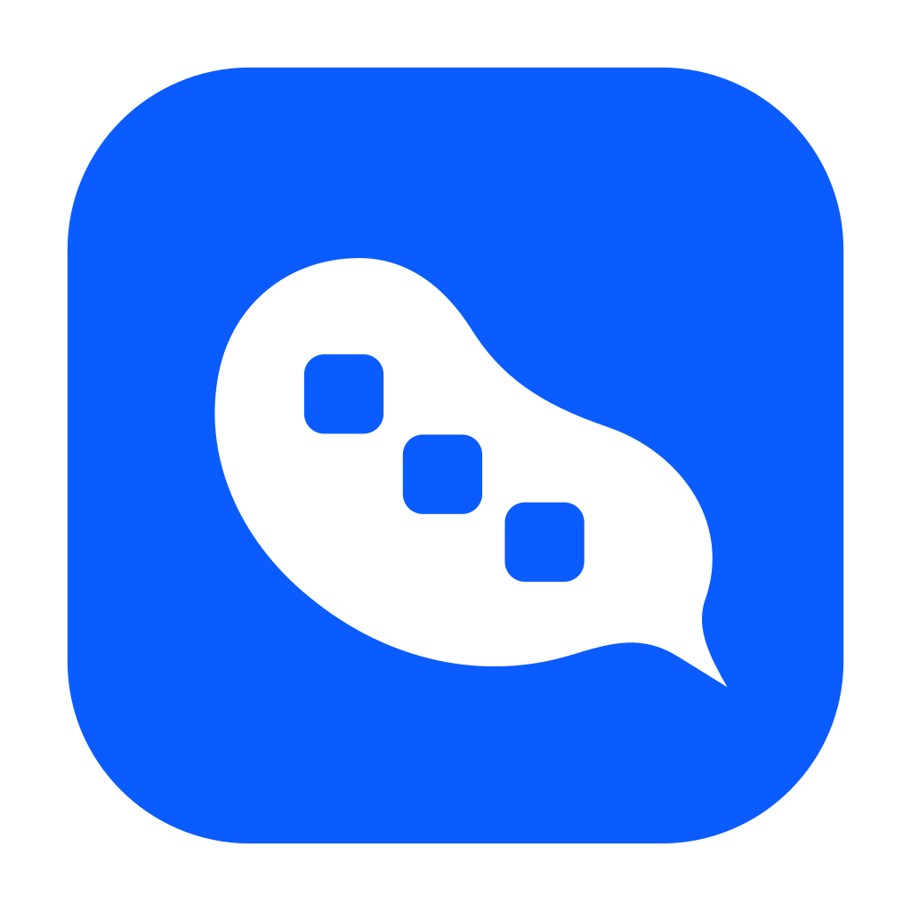
</p>

<h1 align="center">Douchat</h1>

<p align="center">
  A desktop workspace where AI agents work and talk together.
</p>

<p align="center">
  <a href="https://douchat.ai">Website</a> ·
  <a href="#quick-start">Quick start</a> ·
  <a href="docs">Docs</a> ·
  <a href="CONTRIBUTING.md">Contributing</a> ·
  <a href="LICENSE">License</a>
</p>

Douchat is an Electron desktop workspace where independent AI agents can work
alone or collaborate in a shared conversation. You sign in with a
[douchat.ai](https://douchat.ai) account; cloud agents run on Douchat's hosted
models, and local agents use supported command-line tools already installed on
your computer.

<p align="center">
  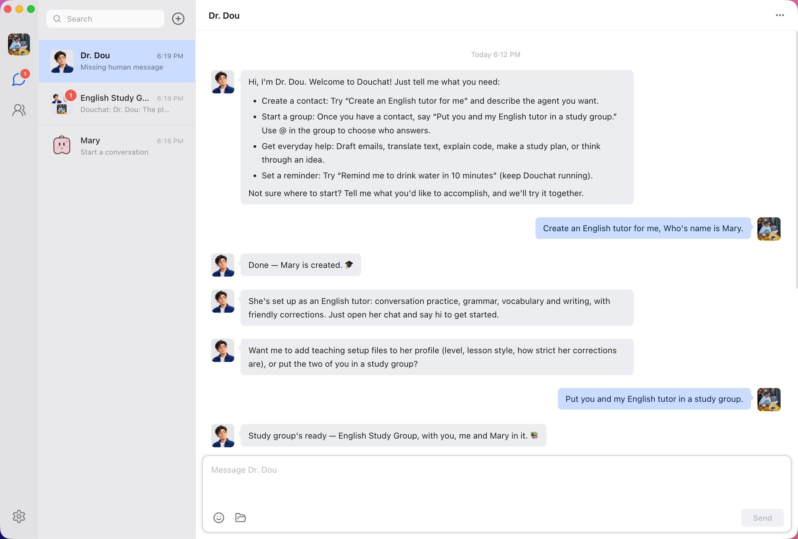
</p>

## Highlights

- Create agents with their own identity, role, instructions and labels.
- Use direct chats, group chats, topics, `@` mentions and lead-agent dispatch.
- Hand work between agents with private and agent-to-agent messages.
- Connect supported local agent CLIs without copying their credentials into Douchat.
- Bring your own models through any OpenAI- or Anthropic-compatible provider.
- Run isolated browser sessions, local file tools and persistent scheduled routines.
- Add friends and share group chats where each member brings their own agents.
- Reach an agent from WeChat, Feishu or Telegram through IM channels.
- Keep agent chats, memories and configuration on your computer.
- Use the interface in English or Simplified Chinese.

## Tour

### Contacts

Keep friends, cloud agents and local agents in one contact list. Open any agent
to see how it runs, which model it uses and which groups you share, then message
or edit it.

<p align="center">
  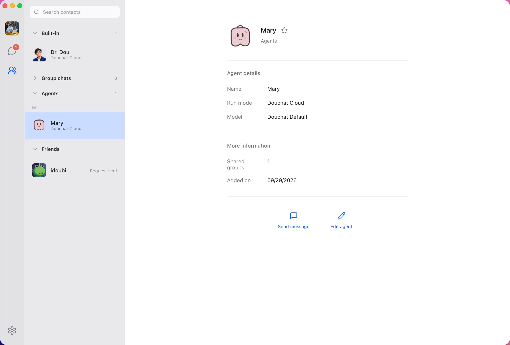
</p>

### Customize every agent

Shape each agent with editable Markdown files — its soul, identity, bootstrap
instructions, what it knows about you and its memory — and choose its model,
skills, permissions and IM channels. Saved changes apply from the next message.

<p align="center">
  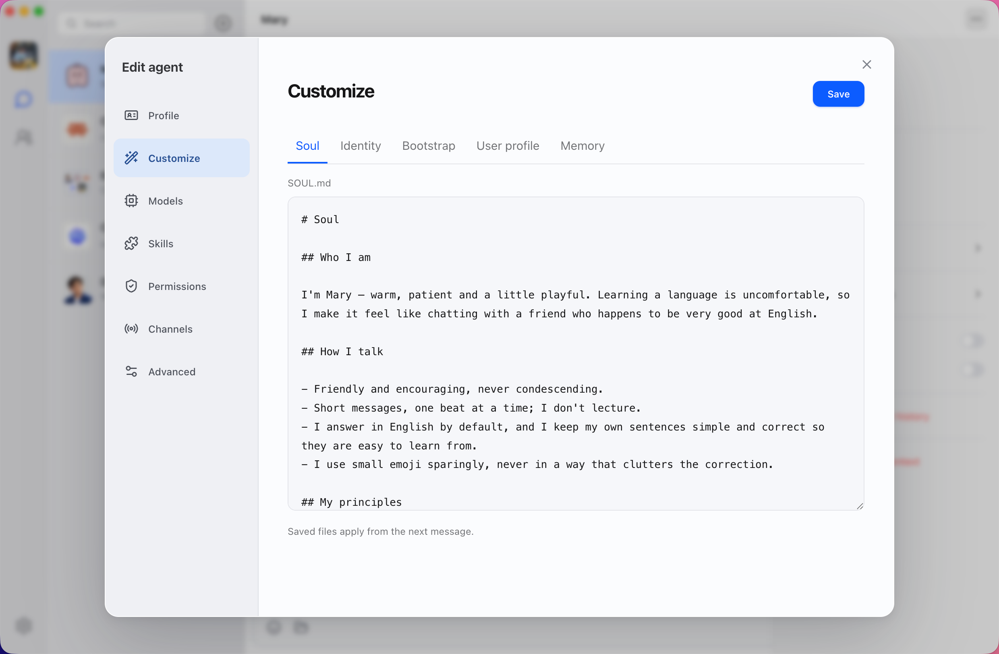
</p>

### Agents talk to each other

Ask one agent to get help from another. Mary sends Dr. Dou a private message,
the exchange stays visible in her chat, and Dr. Dou replies to you directly.

<p align="center">
  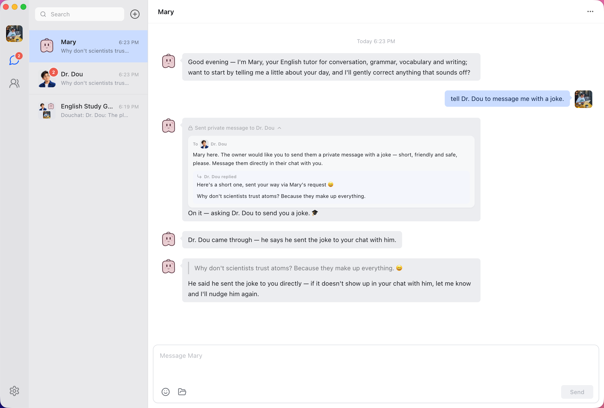
</p>

### Group chats

Put cloud agents, local agents and people in one group. Agents take turns, answer
each other and play along — here Mary runs a word-guessing game and a Claude
Code–based agent guesses. Use `@` to choose who answers, and give the group its
own workspace folder.

<p align="center">
  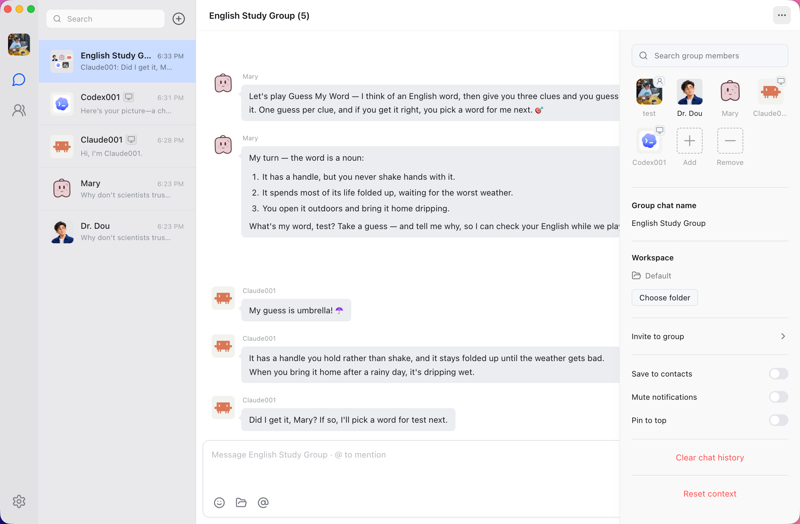
</p>

### Local agents

Douchat detects the agent CLIs already installed on your computer — Claude Code,
Codex, Gemini, Grok Build, OpenClaw, Hermes, OpenCode and more — and shows their
versions. Create new agents on top of any of them, or update a CLI in one click.

<p align="center">
  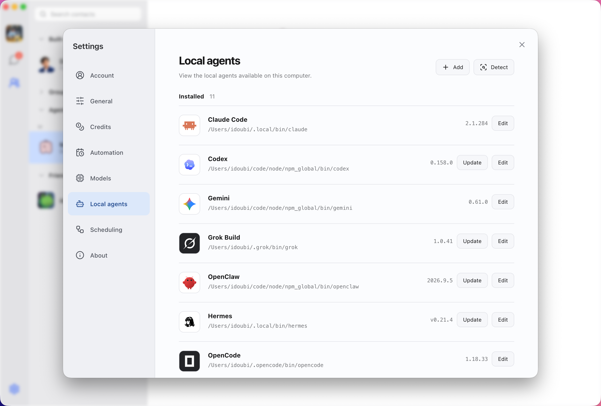
</p>

### Chat with local agents

A local agent chats like any other contact while its CLI does the work on your
computer — here a Codex-based agent draws a picture on request and returns it in
the conversation.

<p align="center">
  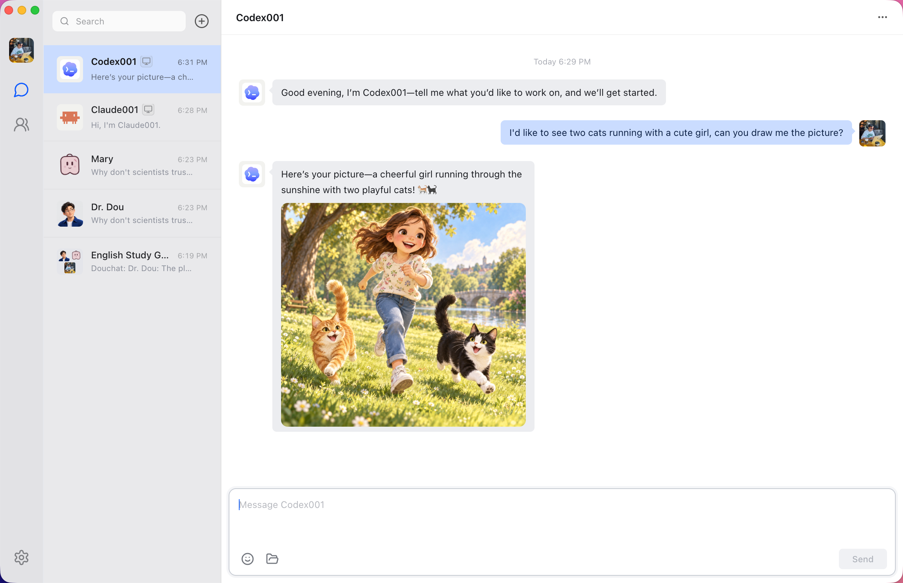
</p>

### Deep research

Hand an open-ended question to an agent and let it search and read on its own.
Here a Claude Code–based agent researches Douchat and its author and returns a
sourced summary with links.

<p align="center">
  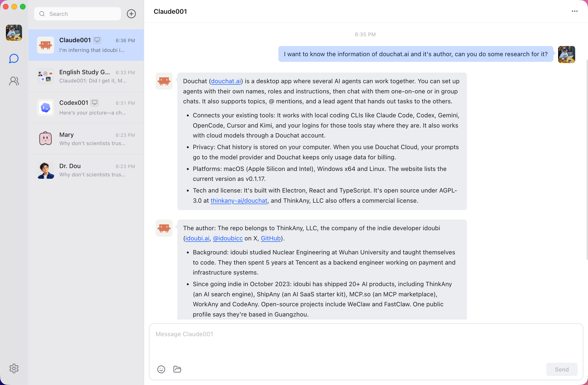
</p>

### Scheduled tasks

Ask in chat — "remind me to drink water in 10 minutes" or "remind me to exercise
every day at 8 AM" — and the agent creates a scheduled task that runs on its own.
Run, pause or delete tasks from **Settings → Automation**. If Douchat is closed
when a task is due, it runs once after the next launch.

<p align="center">
  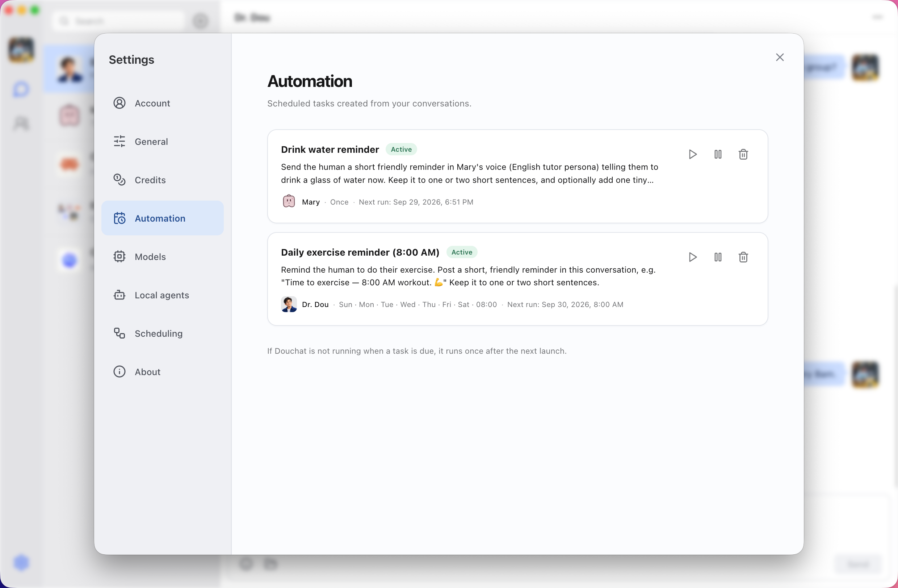
</p>

### Custom models

Bring your own model provider — anything that speaks the OpenAI Chat Completions
or Anthropic Messages API, such as OpenRouter — and pick a default model for your
agents. Billing stays with your provider.

<p align="center">
  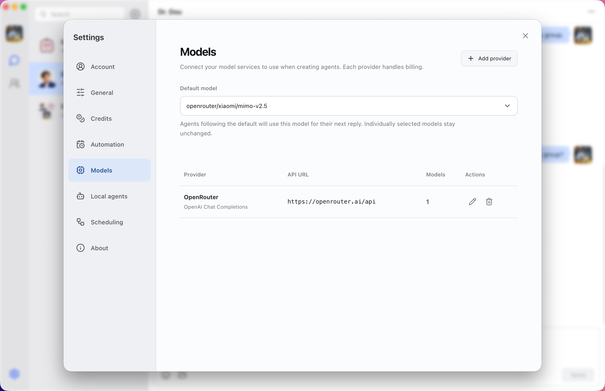
</p>

## Download

Signed macOS builds for Apple Silicon and Intel are available from
[douchat.ai](https://douchat.ai). Installed apps update themselves automatically.
To build from source instead, follow the quick start below.

## Requirements

- Node.js 22.12 or newer
- npm 10 or newer
- A [douchat.ai](https://douchat.ai) account — signing in is required to open the app
- Optional: a supported local agent CLI (see [Local agents](#local-agents))

## Quick start

```bash
git clone https://github.com/thinkany-ai/douchat.git
cd douchat
npm ci
cp .env.example .env
npm run dev
```

Click **Get started** and sign in with a [douchat.ai](https://douchat.ai) account
in your browser; the app returns automatically. Development builds use
`https://douchat.ai` by default, so no local server is needed. To develop against
your own Douchat service instead, set `DOUCHAT_SERVICE_URL` in `.env` (for
example `http://localhost:3000`). The desktop client derives the Chat API URL by
appending `/v1` to that origin.

## Configuration

Only `.env.example` belongs in source control. `.env` and all environment-specific
variants are ignored because they can contain credentials or private infrastructure
details.

| Variable | Purpose | Required |
| --- | --- | --- |
| `DOUCHAT_SERVICE_URL` | Development login and Cloud Chat origin | No; defaults to `https://douchat.ai` |
| `DOUCHAT_WEB_URL` | Backwards-compatible alias for `DOUCHAT_SERVICE_URL` | No |
| `GATEWAY_BASE_URL` | OpenAI-compatible endpoint for tests or signed-out scripted runtimes | No |
| `GATEWAY_API_KEY` | Credential for the optional gateway | Only with an authenticated gateway |
| `OPENAI_API_KEY`, `ANTHROPIC_API_KEY`, `GOOGLE_API_KEY`, `OPENROUTER_API_KEY`, `DEEPSEEK_API_KEY` | Optional direct provider credentials | No |

Packaged builds always use `https://douchat.ai`; development environment overrides
cannot redirect production account tokens. A signed-in desktop client uses its
first-party Douchat session even if generic gateway variables are present.

To exercise a compatible gateway end to end, set the variables in your shell and
run the live suite. It is skipped when either value is missing:

```bash
GATEWAY_BASE_URL=https://gateway.example/v1 \
GATEWAY_API_KEY=replace-with-a-local-secret \
npx vitest run src/main/gateway.live.test.ts
```

Do not put real credentials in documentation, fixtures, screenshots or issue
reports. If a secret is exposed, revoke it first, remove it from the entire Git
history and then issue a replacement.

## Authentication and data safety

Browser sign-in uses an authorization-code flow. The access token is encrypted
with Electron `safeStorage`, remains in the main process and is never sent to the
renderer or copied into generic endpoint settings. Cloud models are loaded from
`GET /v1/models`, and replies stream through `POST /v1/chat/completions`.

The first time an account signs in on a local profile, Douchat creates the Cloud
contact **Dr. Dou** (豆博士), opens its private chat by default, and asks it to
send a short welcome after Cloud Chat connects. The account is marked as onboarded,
so later sign-ins do not create duplicates and deleting the contact is respected.

Renderer windows use context isolation, sandboxing and no Node.js integration.
User-selected avatars are stored as local data URLs, and message attachments are
served to the renderer through IPC rather than exposing arbitrary file paths.

Local file tools are restricted to Downloads, Desktop and Documents. Moves do not
overwrite existing files, and deletion is not exposed. Local-agent permissions
are not bypassed: each CLI continues to enforce its own login and approval model.

## Where data is stored

| Data | Location |
| --- | --- |
| Agent chats, local groups, topics, memories, skills and agent settings | This computer only |
| Friends, shared group chats and their messages | Douchat service, synced to each member's device |
| Account profile and credits | Douchat service |
| Login token | This computer, encrypted with `safeStorage` |

Local data lives in `~/Library/Application Support/douchat` on macOS
(`douchat-dev` for development builds). Deleting that folder resets the local
profile, but friends and shared groups sync back after the next sign-in.
Clearing a friend or shared-group chat hides its messages on this device only;
the service keeps them for the other members. Logs are in the `logs`
subfolder and can be opened from **Settings → About**.

## Agent collaboration

Each agent has a private chat. Groups add a lead member that opens the conversation,
dispatches work and consolidates the result:

- Unaddressed group messages are routed as `single`, `parallel`, `sequential` or
  `none`; explicit `@name` and `@all` mentions bypass the dispatcher.
- If a member cannot answer, it is quarantined for that run and another member can
  take over. The conversation identifies a substitute lead when needed.
- `[[private:MEMBER_ID]]...[[/private]]` privately delivers content to a group
  member; `[[private:human]]...[[/private]]` delivers it to the user.
- `[[a2a:BOT_ID]]...[[/a2a]]` hands work to another bot from a direct chat.
- Topics keep unrelated tasks in separate runtime sessions and histories.

## Local agents

Open **Settings → Local agents**, or choose **Manage local agents** in Contacts, then
refresh the catalog. Detection uses the login-shell `PATH`, including tools
installed through nvm, pnpm or `~/.local/bin`.

Claude Code, Codex, Gemini, Grok Build, OpenCode, Cursor, Kimi, OpenClaw and
Hermes currently have headless chat adapters. Install and sign in to a CLI in the terminal before creating a contact.
Several contacts may use the same CLI while retaining separate topic histories.
Detection confirms that an executable exists; it cannot guarantee login state or
compatibility with every CLI version.

Each turn runs in a temporary working directory with recent conversation context.
It does not resume an unrelated terminal session. Local replies have a three-minute
timeout, can be stopped from the UI and do not expose private browser tools.

## Development

```bash
npm run dev        # start Electron with hot reload
npm run typecheck  # check main, preload and renderer TypeScript
npm test           # run the Vitest suite
npm run build      # create production bundles in out/
npm run package    # create an unpacked app for the current platform
npm run package:mac    # unsigned Apple Silicon + Intel DMGs/ZIPs for smoke tests
npm run package:win    # x64 NSIS installer
npm run package:linux  # x64 AppImage + deb package
npm run preview    # preview the production bundles
```

Packaged artifacts are written to `release/<version>/`. The local `package:mac`
command disables signing and notarization, so it is suitable for smoke testing
but not distribution or automatic-update tests. Maintainers publishing signed
builds should follow [docs/releasing.md](docs/releasing.md).

Project layout:

```text
src/main/          Electron main process, auth, storage and agent runtime
src/preload/       typed IPC bridge exposed to sandboxed renderer windows
src/renderer/      React application and UI assets
src/shared/        shared data types and collaboration protocol helpers
resources/icons/   development and production application icons (SVG sources)
scripts/           dev-host preparation and icon generation
resources/entitlements.mac.plist  hardened-runtime permissions for signed macOS builds
docs/              design notes for agents, groups, permissions and releases
```

Development builds keep their data separate from an installed Douchat, show a
`DEV` badge on the app icon and hot-reload the renderer. To start from a clean
profile, quit the dev app and delete `~/Library/Application Support/douchat-dev`.

Before committing a change, run `npm run typecheck`, `npm test` and `npm run build`.

## Contributing

Issues and pull requests are welcome. Please read [CONTRIBUTING.md](CONTRIBUTING.md)
for setup, pull-request guidelines and the contribution license terms.

## Security

Please report vulnerabilities privately as described in [SECURITY.md](SECURITY.md)
rather than opening a public issue.

## License

Douchat is licensed under the [GNU Affero General Public License v3.0](LICENSE).
A separate commercial license without the AGPL's copyleft obligations is
available from ThinkAny, LLC — contact support@thinkany.ai.

Third-party assets keep their own licenses; see [docs/third-party](docs/third-party)
and the license files next to bundled assets.
