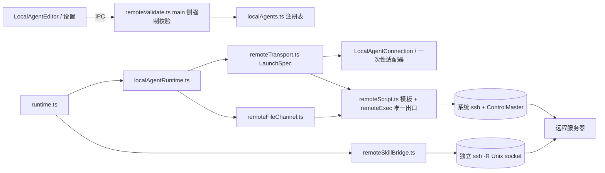

# Douchat 远程 Agent 接入技术方案（v3）

> 状态：设计稿，未实现。v3 相对 v2 的变化：提示词全程不落盘（见 5.3），相关的上传、安全、测试章节同步修订。

## 1. 目标与原则

用户可以把远程服务器上的任意 agent 注册进 Douchat，包括 Codex、Claude、Gemini、Grok、Cursor、OpenCode、Kimi、OpenClaw、FastClaw、Hermes、OMP 和自定义 CLI。注册后，它在单聊、群协作、IM 渠道、好友任务中和本地 agent 行为一致，并且支持图片输入输出、文件产物和技能调用。

- 不保存任何远程凭据，复用本机的 `ssh`、`~/.ssh/config`、密钥和 ssh-agent。
- 数据只在本机和用户配置的服务器之间传输，走 SSH 加密通道，不经过 Douchat 服务端或任何第三方。
- 提示词只存在于内存和传输流里，本机和远端都不写成文件。
- 各 agent 的协议和解析逻辑不改，只替换“进程在哪启动”和“文件怎么搬运”这两个环节。
- 远端的输出、文件、文件名、路径，以及 renderer 传来的输入，都视为不可信。
- 不允许出现路径穿越和命令注入：远端命令只有一个出口，动态值只有一个转义函数，本机不按远端给出的名字或路径写文件。

## 2. 适配矩阵

现状：`codex`、`claude` 走 `LocalAgentConnection` 长连接；其余 agent 由 `localAgentArgs` 一次性 spawn，多数把提示词放在 argv 里；自定义 CLI 由 `customLocalAgentArguments` 做 `{prompt}` 子串替换；技能桥 `openLocalSkillBridge` 是监听 `127.0.0.1` 随机端口的 HTTP 服务，用每轮一次的 Bearer token 鉴权。

| Agent | 启动方式 | 远程提示词通道 | 生成图来源 | 远程特殊处理 |
| --- | --- | --- | --- | --- |
| codex | 长连接 app-server，无 sessionKey 时用 `exec` | JSON-RPC；exec 读 stdin | `$CODEX_HOME/generated_images/<thread>` | `thread/start` 显式传入 sandbox 和审批参数 |
| claude | 长连接 stream-json，兜底一次性 | JSON-RPC；一次性时走 argv 变量 | 无 | 账号登录重试时在远端 `unset ANTHROPIC_*` |
| gemini | 一次性 stream-json | argv 变量 | `<cwd>/nanobanana-output` | 上传 policy 文件；远端 `export GEMINI_CLI_TRUST_WORKSPACE=true` |
| grok | 一次性 streaming-json | argv 变量 | `$GROK_HOME/sessions/*/<sid>/images` | sid 必须是 UUID |
| openclaw | 一次性 | stdin（`--message-file -`） | 无 | 无 |
| cursor / opencode / kimi / fastclaw / hermes / omp | 一次性 | argv 变量 | 无 | 无 |
| 自定义 CLI | 一次性 | argv 变量（`{prompt}` 子串或末尾追加） | 无（统一走发件箱） | `{prompt}` 在远端 sh 中拼接 |

所有 agent 都额外支持文件发件箱（7.5）和技能桥（第 8 节）。

## 3. 总体架构



## 4. 数据模型

```ts
export interface RemoteAgentSpec {
  transport: 'ssh'
  host: string
  port?: number
  user?: string
  identityFile?: string        // 本机绝对路径
  adapter: 'codex' | 'claude' | 'gemini' | 'grok' | 'cursor' | 'opencode'
         | 'kimi' | 'openclaw' | 'fastclaw' | 'hermes' | 'omp' | 'custom'
  executable: string           // 探测后固化为远端绝对路径
  args: string[]               // 结构化参数，仅 custom 允许包含 {prompt}
  remoteCwd: string            // 远端工作目录，绝对 POSIX 路径
  remotePath?: string          // 探测得到的远端登录 PATH
  remoteHome?: string          // 探测得到的远端 $HOME，技能桥转发使用
  allowSharing: boolean        // 默认 false（已取消，见 remote-connections.md 3.1，改由智能体权限控制）
}
export interface LocalAgent { /* 现有字段 */ remote?: RemoteAgentSpec }
export interface CustomLocalAgentInput { /* 现有字段 */ remote?: RemoteAgentSpec }
```

远端命令只接受 `executable + args[]` 的结构化形式，不支持整串 shell 命令，也不支持自定义 ssh `-o` 选项。

## 5. 远程执行层

### 5.1 本机 ssh 调用

- ssh 使用固定绝对路径：macOS/Linux 为 `/usr/bin/ssh`，Windows 为 `%SystemRoot%\System32\OpenSSH\ssh.exe`。不查 PATH，不经过 `.cmd` 包装，spawn 时不开 `shell: true`。
- 主连接 argv：

```ts
['-T',
 '-o','BatchMode=yes','-o','StrictHostKeyChecking=yes',
 '-o','ForwardAgent=no','-o','ForwardX11=no','-o','ClearAllForwardings=yes',
 '-o','PermitLocalCommand=no','-o','ConnectTimeout=10',
 '-o','ServerAliveInterval=15','-o','ServerAliveCountMax=3',
 '-o','ControlMaster=auto','-o',`ControlPath=${controlDir}/%C`,'-o','ControlPersist=300',
 ...(port ? ['-p', String(port)] : []), ...(user ? ['-l', user] : []),
 ...(identityFile ? ['-i', identityFile, '-o', 'IdentitiesOnly=yes'] : []),
 '--', host, REMOTE_BOOTSTRAP, payloadBase64]
```

- 子进程环境只保留 `PATH`、`HOME`、`USER`、`LANG`、`SSH_AUTH_SOCK`，不把本机的 API Key 带到远端。
- `controlDir` 设为 `<userData>/ssh`，权限 `0700`，路径长度不超过 100 字节。agent 停用、删除或应用退出时执行 `ssh -O exit`。Windows 不支持 ControlMaster，自动去掉这三项。

### 5.2 远端命令的唯一形态

ssh 会把 host 之后的参数交给远端登录 shell 解析，而登录 shell 可能是 bash、zsh、fish 或 csh。为避免依赖某种 shell 的语法，远端命令行上只出现两样东西：

- 固定常量 `REMOTE_BOOTSTRAP`：`/bin/sh -c 'eval "$(printf %s "$1" | base64 -d 2>/dev/null || printf %s "$1" | base64 -D)"' sh`。它在上述各种 shell 中解析结果一致，有快照测试覆盖。
- `payloadBase64`：字符集只有 `[A-Za-z0-9+/=]`，在任何 shell 中都没有特殊含义。

payload 是 `remoteScript.ts` 按固定模板生成的 POSIX 脚本，遵守三条规则：

- 动态值只能以 `shQuote()` 的结果写入。`shQuote` 用单引号包裹，把 `'` 替换为 `'\''`，遇到 NUL、`\n`、`\r` 直接抛错。
- 远端目录一律通过 `"$HOME"` 等 shell 变量引用。
- 模板中不出现 `eval`、反引号或未加引号的变量展开。

payload 里只有控制逻辑和经过校验的配置值，永远不含提示词。因此远端 `ps` 看到的 bootstrap 参数里也不会有提示词。

### 5.3 提示词传递（全程不落盘）

提示词只通过 ssh 的 stdin 流传输，本机和远端都不写文件，也不拼进脚本文本。本机写完提示词后立即关闭 stdin（EOF）。按 agent 类型分三种方式：

1. 长连接 agent（Codex app-server、Claude stream-json）：提示词作为 JSON-RPC 或 stream-json 消息，经 stdin 送进远端进程，与本地完全一致。
2. 读 stdin 的一次性 agent（Codex exec、OpenClaw）：脚本直接 `exec`，远端进程继承 ssh 的 stdin，提示词流式进入 agent。

   ```sh
   set -eu; umask 077
   cd -- '/home/me/project'
   exec "$exe" 'exec' '--json' '--skip-git-repo-check' '--ephemeral' '-'
   ```

3. 读 argv 的一次性 agent（Gemini、Grok、Cursor、OpenCode、Kimi、FastClaw、Hermes、OMP、Claude 兜底、自定义 CLI）：脚本从 stdin 把提示词读进内存变量，以 `"$p"` 作为单个参数传给 agent，并把 agent 的 stdin 重定向到 `/dev/null`。

   ```sh
   set -eu; umask 077
   cd -- '/home/me/project'
   p=$(cat; printf x); p=${p%x}
   exec "$exe" '-p' "$p" '--output-format' 'stream-json' < /dev/null
   ```

   - `printf x` 加 `${p%x}` 的写法，是为了保留提示词末尾的换行。
   - `"$p"` 在双引号中只做一次变量展开，不做命令替换，也不分词。提示词里即使含有 `$(rm -rf ~)`，也只是普通字符串。
   - 自定义 CLI 的 `{prompt}`：本机把参数 `a{prompt}b` 拆成字面片段，生成 `'a'"$p"'b'`；参数里没有 `{prompt}` 时，在末尾追加 `"$p"`。语义与 `customLocalAgentArguments` 一致。

补充约束：

- 本机在发送前剔除提示词中的 NUL，因为 argv 无法携带 NUL，`$(cat)` 也会丢弃它。
- 长度上限：Linux 单个 argv 参数上限是 128KB（`MAX_ARG_STRLEN`）。走 argv 的 agent，本机会预先检查提示词长度，超过 120KB 时明确报错，提示压缩上下文或改用支持 stdin 的 agent，不会等远端返回 `E2BIG` 才发现。走 stdin 和长连接的 agent 不受这个限制。
- 可见性：走 argv 的 agent，提示词会在它运行期间出现在远端进程列表中，这和本机运行时的现状一样。服务器是多用户环境时，UI 会建议开启 `hidepid`；支持 stdin 的 agent 一律优先走 stdin。
- 图片路径、发件箱路径这类附加说明，由本机拼进提示词后再发送。它们只进入提示词文本，不进入任何 shell 语句。
- 环境调整都是模板里的字面语句，例如 `unset ANTHROPIC_API_KEY ANTHROPIC_AUTH_TOKEN CLAUDE_CODE_OAUTH_TOKEN ANTHROPIC_BASE_URL`、`export GEMINI_CLI_TRUST_WORKSPACE=true`，以及 `PATH=<shQuote(remotePath)>; export PATH`。

### 5.4 远端可执行文件探测

非交互 ssh 不会加载 nvm 等用户环境。“测试连接”时执行下面的命令，其中命令名必须先通过白名单 `^[A-Za-z0-9._+-]{1,64}$` 校验，且不能以 `-` 开头：

```sh
"$SHELL" -lc 'command -v codex; printf "\n%s\n%s" "$PATH" "$HOME"'
```

返回值不可信，必须全部满足以下条件才采用：可执行路径和 `$HOME` 都是绝对路径、不含控制字符，`$HOME` 还不能含 `:`；PATH 不超过 4096 字节、不含控制字符。校验通过的值固化为 `executable`、`remotePath`、`remoteHome`，之后只以 `shQuote` 的形式写回同一台远端。

### 5.5 进程生命周期

- 每次运行都有独立的远端目录 `t-<uuid>`（见 7.1）。脚本先执行 `printf %s "$$" > "$d/pid"`，然后在远端有 `setsid` 时 `exec setsid "$exe" ...`，没有时直接 `exec "$exe" ...`。
- 中断或超时时，本机关闭 ssh 子进程，然后执行固定模板：`pid=$(cat -- "$d/pid"); case "$pid" in ''|*[!0-9]*) exit 0;; esac; kill -TERM -- "-$pid" 2>/dev/null || kill -TERM "$pid"`。pid 不是纯数字就不执行。
- 超时、并发预算（`processBudget`）、空闲回收的规则与本地一致。连接缓存 key 包含规范化后的全部 `remote` 字段。

## 6. 字段校验（main 侧强制，不信任 renderer）

`remoteValidate.ts` 在保存、导入、启动前、回写探测结果这四个时机执行。校验失败就拒绝，不做自动修正。

| 字段 | 规则 |
| --- | --- |
| host | `^[A-Za-z0-9][A-Za-z0-9._-]{0,252}$` 或 `^\[[0-9A-Fa-f:.]+\]$` |
| user | `^[A-Za-z_][A-Za-z0-9._-]{0,31}$` |
| port | 整数，1-65535 |
| identityFile | 本机绝对路径，经 `realpath` 后是普通文件，不含控制字符 |
| executable | 白名单命令名，或绝对 POSIX 路径（不含 `..` 段，不含控制字符） |
| args | 最多 32 项，每项不超过 1024 字节，不含 NUL、`\n`、`\r`；`{prompt}` 仅 custom 可用 |
| remoteCwd | 绝对 POSIX 路径，`path.posix.normalize` 前后一致，不含 `..`，长度不超过 1024 |
| 危险参数 | codex：`--dangerously-bypass-approvals-and-sandbox`、`--yolo`、`-s`、`--sandbox`、`-c sandbox_mode=*`、`-c approval_policy=*`；claude：`--dangerously-skip-permissions`、`--permission-mode bypassPermissions`；grok：覆盖 `--sandbox` 或 `--permission-mode`；gemini：`--yolo`、`--approval-mode yolo` |

## 7. 远程文件通道

### 7.1 暂存目录

- 根目录固定为 `$HOME/.douchat-remote`。每次建立连接时执行 `mkdir -p`，然后检查 `[ -d ] && [ ! -L ] && [ -O ]`，通过后 `chmod 700`，否则中止。
- 每次运行的目录为 `t-<本机 randomUUID>`，子目录为 `out/`。两者都用 `mkdir -m 700` 创建且不加 `-p`，目录已存在或是符号链接时直接失败。
- 这个目录只存放：输入图片、Gemini policy 文件、`pid`、`.marker`、Codex exec 的 `reply.txt`，以及 agent 写入发件箱的产物。不存放提示词。
- 远端路径的每一段都来自固定前缀、Douchat 生成的 UUID 或已校验的字段。远端返回的路径、agent 回复里出现的路径，都不会被当作操作目标。
- 本轮结束时执行 `rm -rf -- "$HOME/.douchat-remote"/'t-<uuid>'`（`rm -rf` 不跟随符号链接）。建立连接时顺带清理超过 60 分钟的 `t-*` 和 `b-*.sock`：`find "$HOME/.douchat-remote" -maxdepth 1 -name 't-*' -type d -mmin +60 -exec rm -rf -- {} +`。

### 7.2 上传：图片与配置文件

每个文件用一次 `remoteExec`，字节走 stdin，文件名由 Douchat 生成：

```sh
set -eu; umask 077; set -C
d="$HOME/.douchat-remote"/'t-<uuid>'
[ -d "$d" ] && [ ! -L "$d" ] && [ -O "$d" ] || exit 3
head -c '<size>' > "$d"/'img-<uuid>.png'
wc -c < "$d"/'img-<uuid>.png'
```

- `set -C` 防止覆盖已有文件，也防止写穿符号链接。本机核对 `wc -c` 的输出等于 size。
- 图片先经过 `validInputImages` 和 `imageMime` 校验，扩展名只从映射表 `{png, jpg, webp, gif}` 中取。
- 远端图片的绝对路径由本机拼进提示词，写法与现有的 “Inspect these attached image files” 一致，然后按 5.3 发送。

### 7.3 回传：统一帧协议（不用 tar，不按远端名字落盘）

远端输出格式为 `<size> <name>\n<size 字节>`，重复多帧。远端脚本的通用约束：

- 只遍历一层目录。
- 基目录和目标目录都要满足 `-d` 且 `! -L`。
- 每个文件都要满足 `-f`、`! -L`，并且比 `"$d/.marker"` 新（`-nt`），这样不受两端时钟差影响。
- 文件名要匹配 `case` 白名单 `[A-Za-z0-9._-]`。
- `wc -c` 得到的大小不超过单文件上限才输出；数量到达上限后停止。

本机的 `parseFrames` 在纯内存中解析：

- 帧头不超过 256 字节，并匹配 `^(\d{1,9}) ([A-Za-z0-9._-]{1,128})\n$`。
- 按 size 精确读取字节。字节不足或多出，都丢弃整批结果。
- 超过单文件、总量或数量上限时，立刻 kill ssh 并丢弃整批结果。
- 文件名只用于显示，并再取一次 `basename`。字节交给 `store.saveImageAttachment` 或 `ArtifactHost.save`，由 store 生成文件名后落盘。
- 图片再经过 `imageMime` 嗅探，不是图片就丢弃。
- Codex exec 的 `reply.txt` 也用这个协议取回，上限 8MB，按 UTF-8 解码。

### 7.4 各 agent 的生成图定位（均使用 7.3 的模板）

| Agent | 远端目录 | 额外约束 |
| --- | --- | --- |
| codex | `"${CODEX_HOME:-$HOME/.codex}/generated_images"/'<thread>'` | threadId 在本机先校验为 UUID；`CODEX_HOME` 只在远端展开 |
| gemini | `"$cwd"/nanobanana-output` | 与本地 `geminiGeneratedImages` 相同：只收本轮新增的文件；工具报告成功却没有新图时判为失败 |
| grok | `"${GROK_HOME:-$HOME/.grok}/sessions"/*/'<sid>'/images` | sid 必须是 UUID；glob 的中间层要检查 `! -L`；本机只接受文件名出现在 grok 流 `paths` 中的文件 |

限额与本地一致：最多 4 张，单张不超过 8MB，总量不超过 20MB。

### 7.5 文件发件箱（非图片产物）

- 技能桥可用时，文本类产物优先走现有的 `create_file` 工具，内容通过 HTTP 由本机保存。
- 二进制或较大的产物：提示词里告诉 agent，把要交付的文件写到 `<远端 out 目录绝对路径>`，文件名只能用 ASCII 字母、数字和 `._-`。本轮结束后按 7.3 拉回，最多 10 个，单个不超过 20MB，总量不超过 50MB，再由 `ArtifactHost.save` 生成文件卡片。
- 远程 agent 回复中的 `douchat-file:` 和 `file:` 链接一律降级为纯文本，不会根据回复里的路径去取文件。

## 8. 远程技能桥

每轮额外建立一条专用 ssh 连接，把远端的 Unix socket 反向转发到本机桥：

```ts
['-N','-T','-o','BatchMode=yes','-o','StrictHostKeyChecking=yes',
 '-o','ControlPath=none','-o','ExitOnForwardFailure=yes',
 '-o','StreamLocalBindMask=0177','-o','StreamLocalBindUnlink=no',
 '-o','ForwardAgent=no','-o','ForwardX11=no',
 ...同 5.1 的 port / user / identity,
 '-R', `${remoteHome}/.douchat-remote/b-${uuid}.sock:127.0.0.1:${port}`,
 '--', host]
```

- 只用 Unix socket，不在远端开 TCP 端口。socket 权限为 `0600`，远端其他用户无法连接。
- 这条连接设置 `ControlPath=none`，不复用主连接，所以主连接上的 `ClearAllForwardings=yes` 不受影响。转发失败时，`ExitOnForwardFailure` 会让它直接报错。
- sshd 禁止 StreamLocal 转发时，本轮自动关闭技能桥，并在回复中提示“该服务器不支持技能调用”。不会回退到 TCP 转发。
- 提示词中的调用方式改为 `curl --unix-socket <sock> -H 'Authorization: Bearer <token>' -H 'Content-Type: application/json' --data-binary @- http://localhost/tools`，仍然要求用 stdin 或 heredoc 传 JSON。
- 本机桥的逻辑保持不变：每轮一个 token、单并发、请求不超过 3MB、校验参数 schema、拒绝带 Origin 头的请求、本轮结束即关闭。关闭时一并关闭转发连接，残留的 socket 在下次建连时清理。
- 技能调用沿用 owner 审批，审批弹窗额外标注“请求来自 host”。

## 9. 运行时适配

- `localAgentRuntime.ts`：`runConnectedAgent` 和 `executeLocalAgent` 在 `config.remote` 存在时，改用 `LaunchSpec`、5.3 的提示词通道、`RemoteFileChannel` 和帧协议回传；本地分支不变。stdout/stderr 仍交给现有的 `GrokStream`、`GeminiStream`、`localAgentText`、`localAgentExitError` 解析。
- `localAgentConnection.ts`：`connect` 改为接收 `LaunchSpec { file, args, env }`。本地 LaunchSpec 由现有逻辑生成。Codex 的 `thread/start` 继续显式传入 `sandbox: 'workspace-write'` 和现有的 `approvalPolicy`；Claude 继续显式传入 `--permission-prompt-tool stdio` 或 `--permission-mode dontAsk`，不依赖远端配置文件。
- `localAgents.ts`：远程条目不走 PATH 解析，改用 5.4 的探测结果，缓存 10 分钟。
- `localAgentModels.ts`：通过同一个 LaunchSpec 获取模型列表。
- `runtime.ts`：远程 agent 的提示词说明“运行在 host 上，无法访问用户电脑”；不注入 Computer Use 和本机路径提示；不显示工作区文件夹选择器；注入远程技能桥提示和发件箱说明；在群协作共享上下文中把远程 agent 的发言标注为外部来源。
- `social.ts` 及 A2A 入口：`allowSharing=false` 时拒绝好友或其他主人的调用。

## 10. UI 与 IPC

- `LocalAgentEditor.tsx`：新增“运行位置：本机 / 远程服务器（SSH）”切换。远程模式的表单包括 adapter、host、port、user、identityFile、可执行文件、参数列表（逐项填写）、远端工作目录，以及“允许好友调用”开关。开关开启时二次确认，并说明“好友可以在你的服务器上执行命令”。
- “测试连接”依次检查：ssh 免密认证与 host key、`/bin/sh` 和 `base64`、可执行文件与 PATH 探测、暂存目录权限、StreamLocal 转发，最后对 agent 做一次握手或极短的 prompt，确认版本和登录状态。每一步失败都给出可读原因，例如主机指纹未确认时，引导用户先在终端执行一次 `ssh host`。
- 联系人、详情、群成员处显示“远程 · host”标识。远程 agent 首次在某个群中被调用时，提示“群聊上下文和附件会发送到该服务器”。审批弹窗标注“在 host 上执行”，路径按远端路径原样展示。
- IPC：保存、测试、探测都在 main 侧强制调用 `remoteValidate`。renderer 端的校验只用于交互提示。

## 11. 安全设计

### 11.1 威胁模型

- 远程服务器可能被入侵，远端 agent 可能被提示注入，所以远端的所有输出都不可信。
- renderer 和导入的配置不可信。
- 群成员的消息可能被用来诱导 agent。
- 用户自己的 `~/.ssh/config`（包括 ProxyCommand）视为用户主动配置，属于可信。

### 11.2 命令注入

| 注入面 | 防护 |
| --- | --- |
| 本机 shell | 不使用 `shell: true`，ssh 用固定绝对路径，不经过 cmd.exe |
| ssh 参数 | host 和 user 走白名单，且不能以 `-` 开头；host 前加 `--`；user 通过 `-l` 传递；不开放 `-o` |
| 登录 shell 差异 | 远端命令行只有固定常量和 base64 payload |
| 远端脚本 | 按模板生成，动态值只经过 `shQuote`；UUID、pid、size、threadId、sid 都先做正则校验 |
| 提示词 | 只走 stdin 流，不进脚本文本，不落盘；需要放进 argv 时用 `"$p"` 展开 |
| 自定义 `{prompt}` | 本机拆成字面片段，生成 `'lit'"$p"'lit'` |
| 远端回传值 | 探测结果校验后只以 `shQuote` 形式回用；文件名只用于显示；`CODEX_HOME` 等只在远端展开 |
| 技能桥 | 只能调用已登记的工具，参数经 schema 校验，敏感操作需要 owner 审批 |

### 11.3 路径穿越

| 场景 | 防护 |
| --- | --- |
| 本机写入 | 远端数据只在内存中处理，由 store 或 ArtifactHost 生成文件名后落盘；不用 tar/unzip，不按远端名字写文件 |
| 远端暂存根目录 | 检查 `-d`、`! -L`、`-O`，并 `chmod 700` |
| 每次运行的目录 | UUID 命名，`mkdir -m 700` 不加 `-p`，目录已存在即失败 |
| 远端写文件 | Douchat 生成文件名，`set -C`，写后核对大小 |
| 产物读取 | 固定目录加 UUID 校验，逐级检查 `! -L`，单个文件检查 `-f` 和 `! -L`，文件名白名单，不递归，只取比 marker 新的文件；Grok 额外与流中的 paths 取交集 |
| 配置路径 | remoteCwd 规范化前后一致且不含 `..`；identityFile 经 `realpath` 检查；探测结果必须是绝对路径且不含控制字符 |
| 伪造本机链接 | 远程回复中的 `douchat-file:`、`file:` 链接降级为纯文本，`ownedDocumentPath` 兜底 |
| 清理 | 只删除“固定前缀 + UUID”的目录；pid 必须是纯数字 |

### 11.4 执行权限

sandbox 和审批参数由 Douchat 显式传入，不依赖远端配置文件。危险参数在注册时就被拒绝（见第 6 节）。审批弹窗注明执行位置。

### 11.5 数据流向与共享

| 数据 | 去向 | 是否落盘 |
| --- | --- | --- |
| 提示词（含群聊上下文） | SSH stdin 到远端 agent 进程 | 不落盘；走 argv 的 agent 在运行期间会出现在远端进程列表中 |
| 图片附件、Gemini policy | 远端 `t-<uuid>` 目录 | `0600` 权限，本轮结束删除 |
| 回复与产物 | 远端经帧协议回传本机 | 远端所在目录本轮结束删除；本机由 store 保存 |
| agent 发往模型服务商的请求 | 远端 agent 自己发出 | 与本机运行时相同，不是本方案新增的 |

- 远程 agent 默认不可分享，开启时需要二次确认。首次在群中调用时提示数据会外发。共享上下文中标注外部来源。
- 日志不记录提示词、附件、payload 和 token。

### 11.6 连接与凭据

- `BatchMode=yes`，不弹出密码输入。
- `StrictHostKeyChecking=yes`，不使用 `accept-new` 或 `no`。
- 关闭 `ForwardAgent` 和 `ForwardX11`；主连接设置 `ClearAllForwardings`；技能桥连接只转发一个 `0600` 的 Unix socket。
- ControlMaster 的 socket 目录权限为 `0700`，保持 300 秒，agent 停用时主动关闭。

## 12. 改动清单

| 文件 | 改动 |
| --- | --- |
| `src/shared/types.ts` | 新增 `RemoteAgentSpec`，扩展 `LocalAgent` 和 `CustomLocalAgentInput` |
| `src/main/remoteValidate.ts`（新） | 字段校验、危险参数表、`shQuote` |
| `src/main/remoteScript.ts`（新） | bootstrap 常量；启动、上传、帧回传、清理、kill 模板；三种提示词通道；`{prompt}` 拆分 |
| `src/main/remoteTransport.ts`（新） | ssh argv、`remoteExec`、`LaunchSpec`、ControlMaster 生命周期、探测、argv 长度预检 |
| `src/main/remoteFileChannel.ts`（新） | 暂存目录、上传、`parseFrames`、各 agent 产物定位、发件箱 |
| `src/main/remoteSkillBridge.ts`（新） | `-R` Unix socket 转发、远程版提示词、生命周期 |
| `src/main/localAgentConnection.ts` | `connect` 改为接收 `LaunchSpec` |
| `src/main/localAgentRuntime.ts` | 长连接和一次性两条远程分支；Codex exec 回复取回；Gemini 和 Grok 产物回传 |
| `src/main/localAgents.ts` / `localAgentModels.ts` | 远程注册、探测、模型列表 |
| `src/main/runtime.ts` | 远程提示词、技能桥切换、发件箱、链接降级、外部来源标注 |
| `src/main/social.ts` 及 A2A 入口 | `allowSharing` 拦截 |
| IPC、preload、`LocalAgentEditor.tsx`、设置和联系人组件 | 远程表单、测试连接、远程标识、首次提示、审批标注 |

## 13. 测试

- 功能：用假 `ssh` 脚本（解析 argv，在临时 HOME 中用 `/bin/sh` 执行解码后的 payload）配合各 agent 的假可执行文件，覆盖适配矩阵中的全部 agent。测试长连接多轮对话、一次性调用、图片上传、三类生成图回传、Codex exec 回复取回、发件箱、技能桥、中断后远端 kill、残留清理。
- 提示词不落盘：假 agent 运行期间和运行结束后，扫描临时 HOME 及其子目录，断言任何文件中都不含提示词中的唯一标记串；断言 payload 解码后不含该标记串；走 argv 的 agent 收到的参数与原文逐字节一致，包括尾部换行、`$()`、反引号、引号；超过 120KB 的提示词在本机就报错。
- 命令注入：对 `shQuote` 和 `"$p"` 通道做 fuzz 往返测试，输入包括 `'`、`"`、`$()`、反引号、`;`、`|`、`&`、`*`、`\`、`!`、`%`、Unicode、超长串、尾部换行，在 sh、bash、zsh、fish、tcsh 下逐一比对。覆盖自定义 `{prompt}` 前后缀的组合。bootstrap 常量做跨 shell 快照测试。host/user 的恶意用例（`-oProxyCommand=x`、`a;b`、`$(id)`、含空格）必须被拒绝。argv 快照中必须有 `--`，且不能出现 `shell: true`。
- 路径穿越：暂存根目录、`t-uuid`、`out/`、`generated_images/<thread>`、`nanobanana-output`、Grok 中间层分别被替换为符号链接；目录内出现符号链接、硬链接、子目录；文件名含 `../`、换行、空格；threadId 或 sid 不是 UUID；探测结果带控制字符或是相对路径。以上情况全部应被拒绝或跳过。
- 帧解析：size 与实际字节不符、超出限额、帧数过多、帧头超长、内容不是图片、传输中途断开。以上情况都应丢弃整批结果、kill 进程，且本机没有任何文件落盘。
- 权限：危险参数无法保存；`allowSharing=false` 时拒绝调用；技能桥 socket 权限为 `0600`；转发失败时技能桥自动关闭。

## 14. 分期

| 期次 | 内容 |
| --- | --- |
| 第一期（必做） | 适配矩阵中的全部 agent 和自定义 CLI；提示词不落盘通道；图片输入和生成图输出；文件发件箱；远程技能桥；注册、探测、测试连接、编辑器 UI；远程标识与分享开关；第 11 节全部安全项；第 13 节全部测试 |
| 第二期（可选） | 远端常驻守护进程（WebSocket + token 的结构化 API），适用于服务器不开放 SSH 或是 Windows、需要断线续跑、要求完全不经过 shell、需要多设备或免 SSH 共享的场景。只替换 `remoteTransport` 和 `remoteFileChannel` 的实现，上层不变 |

第一期内部的实施顺序：

1. `remoteValidate`、`remoteScript`、`remoteTransport` 及其注入、穿越、不落盘测试。
2. Codex 和 Claude 长连接，加上图片上传和 Codex 生成图回传。
3. 一次性 agent 和自定义 CLI（stdin 与 argv 两种通道），加上 Gemini 和 Grok 的生成图回传。
4. 发件箱和远程技能桥。
5. UI 与分享控制。
