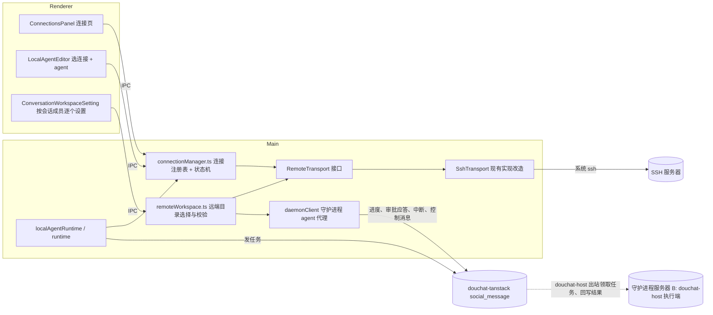
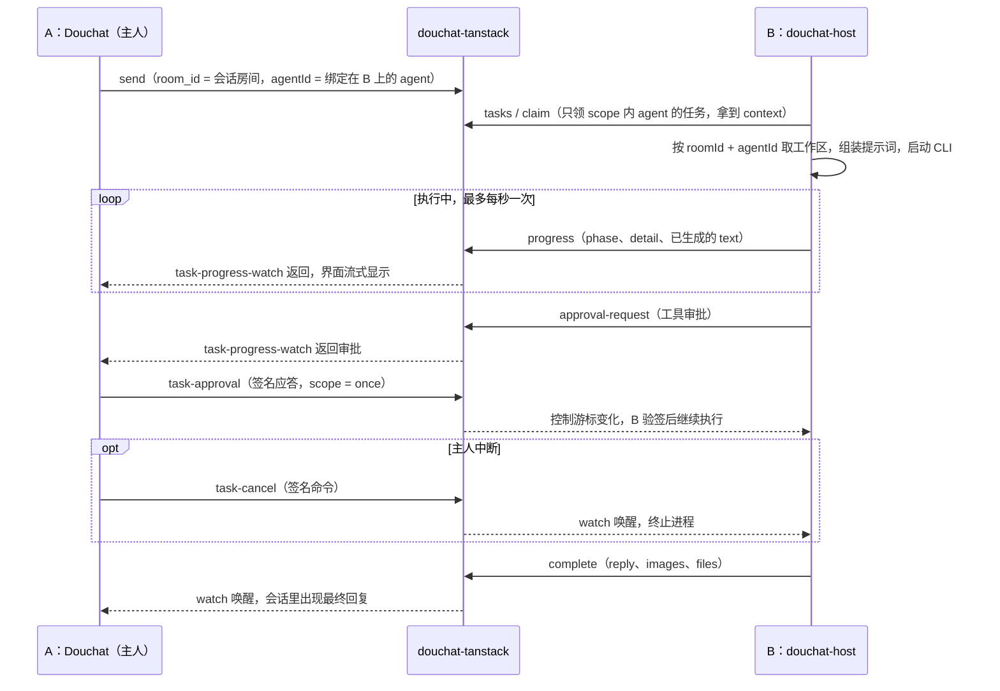

# Douchat 远程连接技术方案

本方案统一远程 agent 的工作区与连接管理，并提供 SSH 和守护进程两种执行方式。守护进程 `douchat-host` 在目标机器上领取和执行任务，通过现有 Douchat 消息服务与桌面端通信，两端均不新增监听端口。远程 Computer Use 按能力验证结果分期开放。

文中 A 指用户的 Douchat 桌面端，B 指运行 `douchat-host` 的目标机器。SSH 任务由 A 调度并在远端执行；守护进程任务由 B 独立领取，A 负责显示、配置和主人控制。

核心约束：

- 工作区绑定执行目标身份和版本，切换目标后不复用原路径或 thread。
- 停用、吊销和故障均不自动回退本机；切换执行端必须由用户显式操作。切换时 running 任务一律失败，不自动重跑。
- 默认采用 60 秒 heartbeat 租约，失联后执行端停止进程。目录串行仅在同一桌面进程、同一连接内，或单个守护进程内保证。
- 主人控制命令在 P2 使用设备签名，由 B 独立验证。任务发送者身份仍依赖服务端，服务端被攻破后仍可能伪造任务；签名审批和 B 本地白名单保持有效。
- 守护进程消息以明文经过消息服务；端到端加密及群任务发送者认证作为 P3 可选能力。Douchat 不主动保存本轮任务提示词，CLI 原生会话记录按 adapter 单独说明。
- 远端输出视为不可信输入，所有执行参数、路径、附件和协议帧均须校验，防止命令注入和路径穿越。

## 1. 现状与问题

| 问题 | 现状代码 | 结论 |
| --- | --- | --- |
| 工作区 | `ConversationWorkspaceSetting` 只用 `canAssignConversationWorkspace` 判断（只看成员是否属于 owner），远程 agent 也会显示；`douchat:choose-conversation-workspace` 弹的是本机 `dialog.showOpenDialog`，写进 `conversation.workspacePath`；`runtime.ts:2442` 对远程直接 `workspaceDirectory = undefined`；远端实际 cwd 是 `localWorkspaces.ts` 派生的 `remoteKey` 对应的 `~/.douchat-remote/w/<hash>`；「打开文件夹」打开的也是本机目录 | 用户以为改了远程工作区，实际只改了一个本机路径，而且这个路径对远程 agent 不生效 |
| 连接管理 | 连接信息（host/port/user/identityFile、remotePath、remoteHome）散落在每个 `RemoteAgentSpec` 里，每个 agent 各自探测、各自配置 | 同一台服务器配多个 agent 要重复填；没有统一的连接状态、开关、断开入口 |
| 执行方式 | `remoteTransport.ts` 和 `remoteScript.ts` 直接生成 ssh argv 和 POSIX 脚本；`localAgentConnection` 消费的是 `LaunchSpec { file, args, env }` | 传输层和 ssh 绑死，接不了第二种连接方式 |

## 2. 总体架构



核心思路：把「连接」从 agent 里拆出来成为一等实体，agent 只引用 `connectionId`。两种连接的执行位置不同：SSH 连接由 A 领取任务，再通过 ssh 在服务器上执行（传输层抽象见第 7 节）；守护进程连接由服务器上的 `douchat-host` 直接领取并执行任务，A 只负责发消息、显示进度和应答审批（第 6 节）。

## 3. 数据模型

```ts
// src/shared/types.ts
export type RemoteConnectionKind = 'ssh' | 'daemon'

export interface RemoteConnection {
  id: string                       // conn_<uuid>
  name: string                     // 显示名，默认取 host 别名
  kind: RemoteConnectionKind
  enabled: boolean                 // 对应图中开关
  targetRevision: number           // SSH 目标身份变更时递增；名称、探测缓存变化不递增
  ssh?: { host: string; port?: number; user?: string; identityFile?: string }
  daemon?: {
    serviceUrl: string             // 消息服务地址，默认当前账号的 webAppUrl（https://douchat.ai）
    hostId: string                 // 服务端分配的主机 ID
    accountId: string              // 注册时的 Douchat 账号，切换账号后该连接不可用
  }
  probe?: {                        // 探测结果，main 侧校验后写入
    os: 'linux' | 'darwin'
    arch: string
    home: string
    path: string
    checkedAt: number
  }
  allowSharing: boolean            // 从 agent 级上移到连接级，agent 级可再收紧
}

export interface RemoteAgentSpec {
  connectionId: string
  adapter: RemoteAgentAdapter
  executable: string
  args: string[]
  allowSharing?: boolean           // 只能比连接更严格
}

export interface AgentWorkspaceBinding {
  path: string                     // 执行目标上的规范化绝对路径
  executionTargetId: string         // local:<deviceId> | ssh:<connectionId> | daemon:<hostId>
  targetRevision: number           // 目标版本；daemon 使用该 agent 的 bindingRevision
}

export interface Conversation {
  /* 现有字段 */
  workspacePath?: string           // 保留，旧数据：本机目录，作为本机成员的兼容回退
  agentWorkspaces?: Record<string, AgentWorkspaceBinding>
                                   // 本机、SSH：权威设置；daemon：B 设置的显示副本（6.5）
}

// 运行时状态，不落盘
export type ConnectionStatus =
  | { state: 'disabled' }
  | { state: 'connecting' }
  | { state: 'connected'; latencyMs?: number; agents: number }
  | { state: 'error'; message: string; retryAt?: number }
```

存储：新增 `<userData>/connections.json`，权限 `0600`。不存私钥和口令。

迁移（启动时一次，幂等）：

1. 扫描所有 `custom` agent 的旧 `remote` 字段，按 `[host, port, user, identityFile]` 去重，生成 `kind: 'ssh'` 的连接，`remotePath`、`remoteHome` 迁到 `connection.probe`。
2. 旧 spec 改写为 `{ connectionId, adapter, executable, args }`，旧 `allowSharing` 为 true 的，连接级 `allowSharing` 取 true，其它 agent 的 agent 级写 false，保证权限不扩大。
3. 迁移前备份 `local-agents.json.bak-before-connections`，并生成持久化迁移计划（源文件哈希、稳定的旧目标 → connectionId 映射、阶段标记）。先原子写入 `connections.json`，再原子改写 agent registry，校验所有引用存在后标记完成；各文件使用同目录临时文件、flush 和 rename。迁移期间不开放 registry 写入或启动 agent。
4. 任一阶段崩溃后按计划继续，不重新生成 ID；源文件哈希不匹配时停止并恢复备份或提示冲突，不覆盖用户修改。允许中间状态存在暂未引用的连接，不允许 agent 引用尚未写入的连接。`remoteValidate` 同时接受旧格式（只读）和新格式；完成标记落盘前，备份和计划均保留。
5. P0 的旧 SSH 目标用 `ssh-legacy:<hash(host, port, user, identityFile)>` 标识（默认值先归一化），目标配置变更时递增持久化版本。P1 在同一迁移计划中将工作区归属映射为 `ssh:<connectionId>`，保留目标版本；同步使旧缓存连接和 thread 失效。只迁移已知归属的数据，无法证明归属的路径保持失效并要求重新选择。

## 4. 远程工作区

### 4.1 规则

工作区的设置维度是「会话 × agent」，保存值同时绑定执行目标身份与版本：同一个 agent 在不同会话里可以用不同目录，同一会话里的不同 agent 也可以各用各的目录。连接决定路径在哪台机器上解析和校验；同一字符串在不同机器上不代表同一工作区。保存的目标身份或版本与当前目标不一致时，不使用该路径。

设置存在执行端：本机 agent 和 SSH agent 由 A 执行，存在 A 的 `agentWorkspaces`；守护进程 agent 由 B 执行，存在 B 的 `workspaces.json`，A 只保留显示用副本（6.5）。共享房间（群聊、agent 私聊房间）也可以设置，只有 agent 主人能改，任何成员 @ 这个 agent 时都使用这个目录。

| 情况 | 工作区设置 | 生效方式 |
| --- | --- | --- |
| 单聊（一个 agent） | 该 agent 在本会话的目录，本机 agent 选本机文件夹，远程 agent 选其服务器上的目录 | `conversation.agentWorkspaces[agentId]` |
| 群聊 | 详情页按成员逐行设置，每行按该成员的运行位置决定选择方式 | 每个 agent 只读自己那一项 |
| 本机 agent 未设置 | 兼容旧数据：有 `workspacePath` 则用它，否则用现有托管目录 | 与现状一致 |
| 远程 agent 未设置 | 沿用 `~/.douchat-remote/w/<remoteKey>`（`remoteKey` 已按会话、话题、agent 派生） | 与现状一致 |

旧的 `conversation.workspacePath` 不迁移、不删除，只作为本机成员的回退值；新的设置一律写 `agentWorkspaces` 的 `{ path, executionTargetId, targetRevision }`。本机旧路径只在原执行设备上回退，不作为切换执行端后自动选择目录的依据。

### 4.2 实现要求

- `src/shared/conversationWorkspace.ts`：`canAssignConversationWorkspace` 去掉对 `remoteRoomId` / `socialRoom` 的整体拒绝，改为按成员判断：只能给自己的 agent 设置；好友私聊（`person`）仍不可设置；新增 `memberWorkspace(conversation, agent)`，返回 `{ location: 'local' | { connectionId }, binding?: AgentWorkspaceBinding, inherited: boolean, stale: boolean }`，UI 和 runtime 共用这一份解析逻辑。
- `ConversationWorkspaceSetting.tsx`：单聊显示一行，群聊按成员逐行显示「agent 名 · 运行位置 · 路径」。本机成员沿用文件夹选择；远程成员按钮为「选择服务器目录」，打开远端目录浏览器（4.3）；「打开文件夹」对远程改为「复制路径」和「在终端打开」（SSH 连接执行 `ssh -t host 'cd <path>; exec $SHELL -l'`，守护进程连接隐藏）。
- `index.ts`：IPC 改为按成员：`douchat:choose-agent-workspace(conversationId, agentId)`（本机成员弹本机对话框）、`douchat:choose-remote-agent-workspace(conversationId, agentId, parent, name)`、`douchat:clear-agent-workspace(conversationId, agentId)`。main 侧根据 `agentId` 自己查出运行位置和连接，不接受 renderer 传的 `connectionId`；本机对话框只对本机成员开放，远程成员调用直接拒绝。旧的 `choose-conversation-workspace` 保留给只有本机成员的会话，写入时改为写每个本机成员的 `agentWorkspaces`。
- `runtime.ts`：`conversationWorkspace(conversationId, sessionKey, config)` 改为按 `agentWorkspaces[config.id]` 解析，本机成员再回退 `workspacePath`；`2442` 行的 `remote ? undefined` 改为远程时返回该 agent 的远端路径，传给 `executeLocalAgent` 的独立 `remoteWorkspace` 参数（与本机 `workspaceDirectory` 区分，也不复用表示登录 PATH 的旧 `RemoteAgentSpec.remotePath`）。`hostedWorkspace` 同样按 agent 和执行目标取，远端路径不得进入本机文件工具。
- `localAgentRuntime.ts`：移除 `connectionPlan` 对远端工作区的无条件清空，分别解析本机与远端工作区；完整绑定加入连接缓存 key。`prewarmConversation` 与正式执行使用同一解析结果，daemon agent 不走本机 prewarm。
- `localWorkspaces.ts` / `RemoteRun`：**本机 agent 的 fingerprint 保持现有公式不变**（避免存量用户 thread 失效）；**远程 agent** 的 fingerprint 纳入 `{ path, executionTargetId, targetRevision }`，默认托管目录也纳入执行目标；连接身份、目标版本或工作区变化均不续接旧 thread。SSH 模式下构造参数从 `workspaceKey` 扩展为 `{ key, executionTargetId, targetRevision } | AgentWorkspaceBinding`，不能在传给 RemoteRun 时丢失目标身份和版本。**守护进程模式下 B 不使用 RemoteRun**，直接在本地调用 `localWorkspace` 和文件操作。`workspaceDirectory()` 在 `path` 模式下输出 `shQuote(path)`；`workspacePath()` 原样返回已校验的路径，供提示词和 Codex `thread/start.cwd` 使用。
- 共享房间任务：`performSocialTask` 现在用 `social:<taskId>` 作为会话 id，`conversationWorkspace` 取不到工作区，`hostedWorkspace` 在 `sharedCallers` 存在时直接抛错。改为按 `caller.roomId` 找到 `remoteRoomId` 对应的本地会话，取 `agentWorkspaces[agentId]`，没有时回退托管目录。
- 工作区锁：P0/P1 只承诺同一桌面进程、同一连接内串行，key 为 `local:<realpath>` 或 `remote:<connectionId>:<realpath>`（P0 使用 legacy 目标 ID）。不同会话或 agent 在该范围内共用目录时串行。B 用单实例锁确保同一安装只运行一个 `douchat-host`，其进程内按真实路径串行，包括默认托管目录。
- 不做跨执行端的分布式目录锁。SSH 别名、不同连接、不同桌面以及 SSH/daemon 同时访问同一目录不保证互斥；能识别相同目标和路径时 UI 提示并发修改风险，不能识别时不声称已隔离。
- agent 变更：远程 agent 改绑到另一个连接、同一 SSH 连接的 host/port/user/identityFile 改变，或 daemon bindingRevision 改变后，它在各会话中的远端路径失效。UI 标记「路径属于原服务器」，运行时按未设置处理并提示，不自动删除；agent 被删除或移出会话时清掉对应条目。
- 存量数据：远程成员会继承到旧 `workspacePath` 的情况不再发生（只对本机成员回退）；会话只有远程成员但 `workspacePath` 有值时，UI 提示「本机文件夹对远程 agent 不生效」并提供「清除」。

### 4.3 远端目录选择与校验

自选工作区可以位于托管根目录之外，按以下规则校验：

- 目录浏览：新增远端操作 `listDirectories(path)`，只返回一层子目录名。SSH 下用帧协议模板（`find "$p" -mindepth 1 -maxdepth 1 -type d ! -name '.*'`，名字过白名单，最多 500 项）；守护进程下通过 `host-control` 调用 B 的 `fs.listDirs`，保存用 `workspace.set`，由 B 完成第 2 步校验。renderer 只能传「父路径 + 子目录名」，main 拼接后再做 4.3 校验。
- 保存前校验（main 侧，两步）：
  1. 本机：绝对 POSIX 路径，`path.posix.normalize` 前后一致，不含 `..`、控制字符，长度 ≤ 1024。
  2. 远端：`cd -P -- <path> && [ -w . ] && pwd -P`，取回规范化后的真实路径，再按第 1 步校验一次，保存的是真实路径（防止通过符号链接指向别处后再被替换）。拒绝 `/`、`/etc`、`/usr`、`/bin`、`/sbin`、`/var`、`/proc`、`/sys`、`/dev`、`/boot` 及其子路径；自选目录拒绝与 `~/.ssh`、`~/.douchat-remote`、`~/.douchat-host` 重叠的目录（包含其子目录及祖先目录，因此 `$HOME` 本身也不可选），以及执行端其它 Douchat 数据目录。目录浏览和解析也只在已授权根目录内进行。
- 默认托管目录走独立分支，仅允许按内部 key 派生的 `~/.douchat-remote/w/<hash>`，不接受用户指定到该目录的路径；自选目录的黑名单不能误拒默认分支。
- 启动时：脚本再执行 `cd -P -- <path>` 并比对 `pwd -P` 与保存值，不一致就失败（目录被换成了符号链接）。
- 产物：Gemini 的 `nanobanana-output` 在用户目录下，沿用「只收本轮新增文件」的快照逻辑；用户目录永不被 Douchat 清理，`rm -rf` 只作用于 `t-<uuid>` 运行目录。
- 提示词说明改为「工作目录是 host 上的 <path>」。

## 5. 连接管理

### 5.1 交互

设置中新增一级入口「连接」，统一管理目标机器和连接状态：

- 顶部标签：`SSH`、`守护进程`。
- 列表每行：启用开关、类型图标、名称、状态点（已连接 / 连接中 / 错误原因 / 已停用）、操作区：
  - `…` 菜单：编辑、测试连接、断开、在终端打开（SSH）、复制安装/卸载命令（守护进程）、删除。
  - 设备图标：扫描该服务器上的 agent，勾选后批量添加。
- 连接上不设工作区。工作区属于「会话 × agent」，在会话详情中设置（第 4 节）。
- 「添加」：SSH 从 `~/.ssh/config` 的 Host 列表选（复用 `listSshHosts`），也可手填 host/port/user/identityFile；守护进程走 6.3 的安装命令向导（需已登录 Douchat 账号）。

`LocalAgentEditor` 的远程模式不再填 host 等字段，改为「选择连接 → 选择 agent 类型 → 可执行文件（默认用扫描结果）→ 参数」。

### 5.2 connectionManager.ts（main）

```ts
interface ConnectionManager {
  list(): RemoteConnection[]
  status(id: string): ConnectionStatus
  save(input: unknown): Promise<RemoteConnection>      // 内部强制 validateConnection
  remove(id: string, mode: 'disable-agents' | 'delete-agents'): Promise<void>
  setEnabled(id: string, enabled: boolean): Promise<void>
  test(id: string): Promise<ConnectionTestReport>        // 分步检查连接、运行环境与 CLI
  discoverAgents(id: string): Promise<DiscoveredAgent[]>
  transport(id: string): RemoteTransport                 // 仅 SSH；daemon 经 daemonClient，调用此方法拒绝
  onStatus(listener: (id: string, status: ConnectionStatus) => void): () => void
}
```

- 状态机：`disabled → connecting → connected | error`，`error` 按 5s、15s、60s、5min 退避重试，窗口聚焦时立即重试一次。
- 保活：SSH 用 `ssh -O check` 检测 ControlMaster，没有 master 时做一次轻量 `true` 探测，周期 60s；守护进程看服务端 `host-list` 返回的 `last_seen_at`（45s 内算在线）。
- 停用连接：SSH 关闭 ControlMaster，中断该连接上正在运行的轮次；daemon 经签名绑定操作将执行端标记为 disabled、bindingRevision 加一，并按 6.8.2 结束任务，不以移除配置触发本机回退。相关 agent 显示「执行端不可用（已停用）」，新任务直接 failed。断网导致停用尚未提交时 UI 显示「待同步」，B 最迟按租约规则停止。
- 删除连接：有 agent 引用时弹框二选一（停用这些 agent / 一并删除）。
- 探测缓存从「按 agent」改为「按连接」，10 分钟 TTL，结果写入 `connection.probe`。
- 状态通过已有 snapshot 推送给 renderer，新增字段 `snapshot.connections` 和 `snapshot.connectionStatus`。

### 5.3 agent 扫描

一次远端调用探测所有已知 CLI，命令名都来自内置常量：

```sh
"$SHELL" -lc 'for c in codex claude gemini grok cursor-agent opencode kimi openclaw fastclaw hermes omp; do p=$(command -v "$c" 2>/dev/null) && printf "%s\t%s\n" "$c" "$p"; done; printf "\n%s\n%s" "$PATH" "$HOME"'
```

返回值均视为不可信：可执行路径和 HOME 必须是规范化绝对路径、不含控制字符，HOME 不含 `:`；PATH 不超过 4096 字节、不含控制字符，每个非空条目必须为绝对路径。main 校验后保存到对应连接的探测缓存；SSH 脚本回用时仅通过 `shQuote` 插入。每个命中项再执行一次 `<exe> --version`（超时 5s）显示版本。守护进程侧对应控制消息 `host.discover`。

SSH 的测试连接依次检查免密认证与 host key、`/bin/sh` 和 `base64`、可执行文件与 PATH、暂存目录权限、StreamLocal 转发，以及 CLI 握手或最短任务。每一步失败返回可读原因；守护进程连接检查主机在线、协议能力、配置确认和 CLI 可用性。

### 5.4 IPC

`douchat:list-connections`、`save-connection`、`remove-connection`、`set-connection-enabled`、`test-connection`、`discover-remote-agents`、`list-remote-directories`、`create-daemon-enrollment`（生成 `DOUCHAT_ENROLL`）、`wait-daemon-enrollment`（等主机上线）、`cancel-agent-task`（守护进程 agent 的中断）。全部在 main 侧调用 `validateConnection`，renderer 校验只做提示。

## 6. 守护进程连接

### 6.1 模型：B 领取并执行绑定在它上面的 agent 的任务

现有消息链路（代码依据）：

- 桌面端 [social.ts](../src/main/social.ts) 只发出站 HTTPS：`heartbeat` 每 10s 上报本机 agent 在线和正在等待的审批（`approvals`），`watch` 长轮询房间变更，`tasks` / `claim` / `complete` 每 2.5s 拉取并领取任务（最多 8 个并发），结果先写本地 outbox 再发布，失败可重发而不重跑。
- 服务端 douchat-tanstack `src/modules/social/service.ts`：`tasks` 按 `localIds` 返回 `pending` 任务；`claim` 写入 claim 令牌，同时拼好 40 条历史作为 `context`；`complete` 校验 claim 后写回 `reply`。`waitForSocialChange` 最长挂起 15s，聊天变更同实例由 `notifyRoom` 立即唤醒，跨实例由 douchat-tanstack `src/modules/social/notifications.ts` 回退重查 DB，不依赖粘性会话；该回查只比较房间 revision，控制通知需新增 6.8.3 的持久化检查。
- 现有任务按 agent 归属排队，但仅凭账号归属和客户端传入的 localIds 不能区分执行设备；守护进程接入后统一使用 6.8.1 的权威执行端绑定。

守护进程连接就利用这一点：被控机器 B 上的 `douchat-host` 是一个没有界面的 Douchat 执行端。agent 绑定到守护进程连接后，它的任务不再由 A（用户的 Mac）领取，而是由 B 领取、执行、回写。`room_id`、`agent_id`、消息格式都和现在一样，B 只是换了一台设备来接单。

| 角色 | 网络行为 | 是否新开端口 |
| --- | --- | --- |
| B：`douchat-host` | 出站 HTTPS 到 `https://douchat.ai`，和桌面端一样 heartbeat、watch、tasks、claim、complete | 不监听任何 TCP 端口 |
| A：Douchat 桌面端 | 不变；另外为自己的守护进程 agent 拉取进度、应答审批 | 不监听 |
| douchat-tanstack | 现有 443；social 路由加少量 action，另加 1 个主机入口路由，新增主机、执行端绑定、任务执行记录和控制游标表（6.4.1） | 不新开端口，不新部署 relay，不引入 WebSocket |

```mermaid
flowchart LR
  A[A：Douchat 桌面端<br/>dch_ 令牌] -->|send / watch / 进度 / 审批应答| T[(douchat-tanstack<br/>social_message<br/>room_id 与现在一致)]
  O[群里其他成员] -->|@ agent| T
  B[B：douchat-host<br/>dhh_ 令牌] -->|heartbeat / tasks / claim / complete / 进度 / 审批请求| T
```

三种会话的处理：

| 会话 | 服务端房间 | 说明 |
| --- | --- | --- |
| 群聊 | 现有 group 房间 | 任何成员 @ 该 agent，任务由 B 领取 |
| 你和好友私聊 | 现有 `dm-<pair>` 房间 | 不挂 agent，不变 |
| 你和该 agent 一对一 | 新增 agent 私聊房间 `dm-agent-<pair(ownerId, agentId)>`，持久化 `kind: 'agent'`（展示为私聊，避免与好友 `direct` 的双方成员规则混用），成员只有你，`agents` 只有这个 agent | 类比好友私聊。本地会话 `direct-<agentId>` 记下 `remoteRoomId`，之后和 `friend:` 会话一样同步。绑定前的本地历史不上传 |

A 侧的配合：

- A 的 `heartbeat` 和 `tasks` 的 `localIds` 排除绑定在守护进程连接上的 agent，减少无效请求；服务端仍按 6.8.1 权威绑定拒绝其它桌面、旧客户端和其它 host 抢单。这些 agent 的在线状态由 B 的 `heartbeat` 上报，A 离线时 B 照常处理群里其他人的 @。
- A 给 agent 私聊房间发消息时显式带 `agentId`（私聊不会像群聊那样自动选 agent）。

数据流与隐私：守护进程 agent 的会话内容和群聊一样，以明文经过并存储在 douchat-tanstack（`claim` 时服务端拼接最多 40 条历史）。端到端加密属于 P3 可选能力（6.6）。Douchat 不主动把本轮任务提示词写入 B 的运行文件或日志；CLI 自身的原生会话记录单独按 adapter 说明，不能承诺其不保存内容。

### 6.2 douchat-host 形态

部署分为「安装器」和「常驻程序」两层：

| 层 | 形态 | 职责 |
| --- | --- | --- |
| 安装器 `douchat-host-installer` | 原生小二进制（Rust 或 Go，约 3MB） | 下载、校验、安装、升级、修复、回滚、卸载；常驻程序升级坏了也能修回来 |
| 常驻程序 `douchat-host` | TypeScript 打包的 Node SEA 单文件 | 注册、连服务端、领取并执行任务、本地 IPC |

P2 先不做独立安装器：`install.sh` 直接下载并校验常驻程序，升级由 `douchat-host upgrade` 完成（下载到新的版本目录，运行 `--version` 自检通过后切换 `current` 软链接，再重启服务；任一步失败都保留旧版本）。P3 再补安装器，接管升级、修复和崩溃恢复。

- 实现：TypeScript，复用 Douchat main 的执行代码，包括 `performSocialTask` 的提示词组装、`localAgentConnection` 的 adapter 协议解析、`localWorkspaces`、`remoteValidate` 的白名单和危险参数表。用 esbuild 打包，再用 Node SEA 把 Node 运行时和打包后的 JS 合成一个可执行文件，提供 linux 和 darwin 的 amd64、arm64 构建产物，服务器不需要另装 Node。共享模块中用到 Electron 的部分（`safeStorage`、`dialog`、`BrowserWindow`）抽成接口，host 侧给无界面实现，执行逻辑只维护一份。
- 体积：单文件预计约 100MB，实际以构建产物为准。下载用 gzip 压缩，同一发行构建只下载一次，升级时才重新下载。
- 适用 agent：只支持 CLI 类 adapter（与 `RemoteAgentSpec` 相同：codex、claude、gemini 等），使用 B 上已登录的 CLI 账号。依赖 Douchat 内置模型密钥的 agent 不能绑定到守护进程连接。
- 运行身份：普通用户，检测到 root 时拒绝启动（可用 `--allow-root` 显式放开）。
- 安装目录：

  ```text
  ~/.douchat-host/
    bin/douchat-host -> versions/<version>/douchat-host   # current 软链接
    versions/<version>/douchat-host                        # 不可变版本目录，保留当前和上一个版本
    config.json      # 0600，含 hostId、serviceUrl、hostToken、allowedRoots
    trust.json       # 0600，主人设备公钥、撤销记录、已应用签名版本和防重放状态
    agents.json      # A 下发的 agent 配置缓存
    workspaces.json  # 工作区完整绑定对象（6.5）
    sessions/        # 原生会话续接记录，同 localWorkspaces
    outbox/          # 未发布的结果
    logs/            # 服务日志，按大小轮转
  ```

  运行目录复用 `~/.douchat-remote`。另在 `~/.local/bin/douchat-host` 放一个软链接，方便在终端直接执行子命令。
- 常驻：由 `douchat-host` 生成 launchd 或 systemd 配置并启动系统服务。

  macOS 写入 `~/Library/LaunchAgents/ai.douchat.host.<hash>.plist`，用 `launchctl bootstrap gui/$(id -u)` 加载（6.7 S1 依赖这一点）：

  ```xml
  <key>ProgramArguments</key>
  <array><string><安装时解析的绝对 HOME>/.douchat-host/bin/douchat-host</string><string>__service</string></array>
  <key>EnvironmentVariables</key>
  <dict><key>PATH</key><string><安装时采集并校验的绝对 PATH></string></dict>
  <key>RunAtLoad</key><true/>
  <key>KeepAlive</key><true/>
  <key>ProcessType</key><string>Background</string>
  <key>StandardOutPath</key><string><安装时解析的绝对 HOME>/.douchat-host/logs/service.log</string>
  <key>StandardErrorPath</key><string><安装时解析的绝对 HOME>/.douchat-host/logs/service.log</string>
  ```

  Linux 写入 `~/.config/systemd/user/douchat-host.service`，执行 `systemctl --user enable --now`，并提示 `loginctl enable-linger`，否则用户退出登录后服务会停：

  ```ini
  [Unit]
  Description=Douchat host
  After=network-online.target

  [Service]
  Type=simple
  Environment=PATH=<安装时采集的 PATH>
  ExecStart=%h/.douchat-host/bin/douchat-host __service
  Restart=always
  RestartSec=2
  KillMode=control-group

  [Install]
  WantedBy=default.target
  ```

  没有 systemd 时退回 `nohup` 加 crontab `@reboot`。
- launchd 的路径在生成时展开为绝对路径并做 XML 转义，不向 plist 写字面量 `~`。PATH 必须显式写入：launchd 和 systemd 启动的服务拿不到用户 shell 的 PATH，不写就找不到 `codex`、`claude` 等 CLI（nvm、Homebrew、`~/.local/bin` 安装的尤其如此）。安装时从用户登录 shell 采集一次 PATH（`$SHELL -lc 'printf %s "$PATH"'`），过滤掉相对路径、不存在的目录、全局可写（mode & 0o002）的目录、以及不属于运行用户且不属于 root 的目录后写入配置；`douchat-host doctor` 会检查已绑定 agent 的 executable 在服务环境下能否找到。
- `KillMode=control-group`：服务停止或重启时，连同它拉起的 CLI 子进程一起结束，不留孤儿进程。
- 网络：只向 `serviceUrl` 发出站 HTTPS，支持 `HTTPS_PROXY`。本机只有 `~/.douchat-host/ctl.sock`（`0600`），给 `status`、`desk` 等子命令用。
- 主循环：复用 `social.ts` 的调度结构，加入 6.8 的绑定、租约和控制游标检查。`heartbeat` 每 10s 上报本机 agent 和 `approvals`；`watch` 长轮询本机 agent 所在房间和本机控制消息；`tasks` / `claim` 每 2.5s，最多 8 个并发；结果先写 `outbox/` 再 `complete`，中断后不自动重跑。空闲时网络失败按 1s、5s、15s、60s 退避；有活动任务时独立租约计时，重试不延长 60s 停止期限。

### 6.3 注册与绑定

Douchat「连接 → 守护进程 → 添加」生成一条安装命令，用户复制到服务器执行：

```sh
curl -fsSL https://cdn.douchat.ai/host/install.sh | DOUCHAT_ENROLL='dch1_<base64url>' sh
```

`DOUCHAT_ENROLL` 含协议版本、初始主人设备公钥及其指纹、`serviceUrl`、`enrollTicket`（A 用 `dch_` 令牌申请，一次性，15 分钟过期，服务端只存哈希）和 `exp`。用环境变量传递，避免放入普通 argv；不得将其输出到日志。环境变量不构成对同用户或特权进程的保密边界。初始公钥来自用户从 A 复制的安装命令，B 本地保存这一信任锚，不从服务端响应替换（6.8.4）。

`install.sh` 使用 POSIX sh，只负责下载、验证二进制并交给它完成安装：

1. 识别 `uname -s`、`uname -m`；请求 `cdn.douchat.ai/host/channel/stable/<target>`，跟随重定向得到不可变的 `/host/releases/<version>/<target>`。严格校验重定向地址：不允许查询参数和片段，`version` 只能含 `[A-Za-z0-9._-]`，确保二进制和校验文件属于同一版本。
2. 并行下载 `douchat-host.gz` 和 `SHA256SUMS`，要求恰好有一条对应记录，再用脚本内置的 minisign 公钥验证 `SHA256SUMS.minisig`，验证通过后核对二进制摘要。
3. 解压到 `~/.douchat-host/versions/<version>/`，运行 `douchat-host --version`，自报版本必须等于选中的版本，通过后建立 `bin/douchat-host` 软链接。
4. 调用 `douchat-host setup`：生成 Ed25519 密钥（用于轮换令牌）；调用 `enroll{ ticket, signKey, info }` 拿到 `hostId` 和 `hostToken`（`dhh_` 前缀）；按 6.2 写入 launchd plist 或 systemd unit 并启动；终端打印「已连接到 <账号> 的 Douchat」。
5. `setup` 中途失败（退出码 3）时，脚本自动重跑一次；仍失败则打印 `douchat-host doctor` 的结论。重复执行同一条安装命令是幂等的：已安装同版本时跳过下载，票据已用过时提示重新生成。

A 的向导显示「等待服务器连接…」，看到主机上线后让用户命名（名称只存在本机 `connections.json`），再通过控制消息 `host.discover`（6.4.3）扫描 B 上的 CLI，用户勾选后创建或改绑 agent。

绑定和解绑：

- 绑定：A 签名提交执行端绑定与运行配置（adapter、executable、args、instructions、systemFiles、skills、permissions、thinkingLevel、有效 allowSharing = connection.allowSharing && agent.allowSharing !== false），服务端以事务和 CAS 更新 6.8.1 的权威绑定；B 验证签名并确认配置版本后才领取。`remote_host.agents` 只是配置分发缓存，不是归属依据。
- 修改：A 签名同步配置，按 agent 的 configRevision / permissionsRevision 做 CAS，`agents_revision` 作为主机分发版本加一。普通配置影响后续任务；权限收紧、停用和绑定变化立即使相关授权失效，权限放宽或「总是允许」须 B 验证并确认应用后生效（6.8.4）。
- 停用：保留目标归属并标记 disabled；吊销/卸载：目标 revoked，令牌失效。两者都不回退 A；host 离线超过租约阈值时也按不可用处理，agent 显示「执行端不可用」，排队及新任务 failed。
- 显式解绑或改绑：用户选择新的执行端（本机时明确 deviceId、CLI、账号和目录），签名提交 CAS 切换，bindingRevision 加一。pending 由新执行端领取；running 一律 failed，回复「执行端已变更，任务未完成」，用户手动重发。既有服务端私聊房间保留，不自动迁回仅本机历史。
- 删除连接的「停用这些 agent」沿用不可用状态；「一并删除」还需删除 agent 引用。删除、主机故障、离线或 scope 缺失均不得隐式执行解绑。

子命令：`status`、`agents`（列出已绑定 agent）、`doctor`（检查服务状态、PATH、CLI 可用性、网络）、`upgrade`、`logs`、`uninstall`（停服务、删除 plist 或 unit、向服务端注销，`--purge` 时再删 `~/.douchat-host`）。已有 SSH 连接的服务器，可在连接菜单里选「安装守护进程」，Douchat 通过现有 `remoteExec`，经 stdin 传入同一条命令（P3）。

### 6.4 服务端改动（douchat-tanstack，复用 social）

#### 6.4.1 数据表与迁移

`schema.sqlite.ts` / `schema.postgres.ts` / `schema.mysql.ts` 三套同步，加 drizzle 迁移。不再限定只新增一张表：绑定唯一性、任务执行租约和通知游标需要可事务更新的持久化记录。

```text
remote_host
  id, user_id
  status                         # enrolling | active | revoked
  ticket_hash, ticket_expires_at  # 一次性票据，15 分钟过期；成功后置空
  sign_key, token_hash            # B 的 Ed25519 公钥；hostToken 只存哈希
  trusted_devices                # 已签名设备登记的分发副本；B 的 trust.json 是本地信任锚
  info                           # { os, arch, version }
  agents, agents_revision        # 签名配置缓存（≤ 1MB），含每个 agent 的配置/权限版本
  last_seen_at, created_at

social_executor_binding
  owner_id, local_id              # 联合主键；一个 agent 只有一个执行端
  executor_kind, executor_id      # desktop:<deviceId> | host:<hostId>；SSH 仍由 desktop 执行
  execution_target_id             # 实际 cwd 所在目标：local / ssh / daemon
  state                          # enabled | disabled | revoked
  binding_revision               # 单调递增，CAS 切换/停用/重新启用
  config_revision, permissions_revision, signed_binding

social_task_execution
  task_id                        # 主键，关联聊天任务
  owner_id, local_id, executor_kind, executor_id, binding_revision
  claim_hash, lease_expires_at, state  # active | finished；防止旧结果/旧租约复活
  cancel_requested, signed_cancel    # 冻结成功 complete，待 B 停止或租约到期
  created_at, finished_at

social_channel_cursor
  channel_id                     # 主键：owner:<ownerId> 或 host:<hostId>
  revision                       # DB 原子递增的整数；JSON 以十进制字符串传输
```

聊天任务、进度、审批、控制仍复用 `social_message`；任务执行身份与租约保存在 `social_task_execution`，不再只依赖旧 claim 的账号前缀。为绑定查找、活动租约过期和子消息按 host/task 查询补以下索引：

```sql
-- 按状态和 agent 查找任务（claim 时）
CREATE INDEX idx_message_status_agent_created 
  ON social_message(status, agent_id, created_at);

-- 按执行端查找绑定（scope 检查）
CREATE INDEX idx_binding_executor_state 
  ON social_executor_binding(executor_id, state);

-- 租约到期扫描
CREATE INDEX idx_execution_active_lease 
  ON social_task_execution(state, lease_expires_at);
```

上线迁移先建表再开放 host 接口。所有原子状态转换同时更新任务行、执行记录、相关游标；跨三种数据库验证事务与 CAS 行为。

#### 6.4.2 主机身份与权限范围

`dhh_` 令牌得到 `actor = 主机所属用户` 和 `hostId`，有效 scope 从 `social_executor_binding` 查询，不能以 `remote_host.agents` 缓存或客户端 `localIds` 作为授权依据。桌面端引入经鉴权绑定的 deviceId（来源见 6.8.1「设备身份」）；旧客户端无设备身份时不能操作已有权威绑定的 agent。

- `heartbeat`、`tasks`：只允许当前绑定 enabled 且 executor 匹配的 agent，heartbeat 另校验并续期活动 claim（6.8.2）。
- `claim`、`complete`、`delegate`、进度和审批：统一检查任务、绑定版本、执行端、有效 claim 和租约；成员及 `interactionHumans` / `interactionAgents` 检查继续生效。绑定变化后旧 scope 不能 complete。
- `watch`：只返回 scope 内房间的变更通知和本 host 的控制变更；控制通道游标与房间 revision 分开（6.8.3）。
- 历史附件：只允许通过 `task-attachment` 读取当前 claim context 明确列出的附件（6.5），不开放房间通用历史读取。
- 其它 action（`send`、`messages`、好友、建群、改群等）一律拒绝。B 不能以用户身份发言，也不能自行翻阅房间历史。

#### 6.4.3 任务子消息：进度、审批、中断、控制

这些都写在 `social_message` 里，用 `status` 区分，不属于聊天内容。

| 类型 | `id` | `room_id` | `status` | 写入方 → 读取方 | 内容 |
| --- | --- | --- | --- | --- | --- |
| 进度 | `<taskId>:progress`，每个任务一行，原地更新 | 任务所在房间 | `x-progress` | B → A（主人） | `content = { seq, phase, detail, text }`，`text` 为目前已生成的回复，最多 32000 字符 |
| 审批 | `<taskId>:approval:<uuid>` | 任务所在房间 | `x-approval` → `x-allowed` / `x-declined` / `x-expired` | B 创建，A 应答 | `content` 为审批请求（capability、operation、details、requester），`reply` 为应答和作用域（`once` / `task` / `session`；持久权限修改单独签名并确认（6.8.4）） |
| 中断 | `<taskId>:cancel` | 任务所在房间 | `x-cancel` | A（主人）→ B | 含 taskId、claim、bindingRevision 的签名命令 |
| 控制 | `ctl:<hostId>:<uuid>` | `host:<hostId>`，只用于主机管理，不是会话 | `x-control` → `x-done` / `x-error` | A → B | `content = { method, params }`，`reply` 为结果。方法：`host.info`、`host.discover`、`fs.listDirs`、`fs.resolveDir`、`workspace.get`、`workspace.set`、`workspace.clear`；签名规则见 6.8.4 |

规则：

- 不进入聊天：聊天状态集合为 `sent / pending / running / succeeded / failed`，任务状态集合为 `pending / running / succeeded / failed`，领取只查 pending。子消息的 status 一律带 `x-` 前缀，与聊天/任务状态在字面上不相交，因此任何只按状态集合过滤的查询都不会把子消息当成聊天或任务（例如失败的控制消息不会被当成失败任务）；不以 `room_id` 是否为 `host:` 作为唯一区分条件。聊天查询、列表/预览聚合和 claim 历史在 SQL 排序、分页及 limit 前过滤子消息，保留普通 `sent` 消息。子消息不更新房间 revision，也不进入其它成员的 watch。审批等待的公开标识沿用 heartbeat，避免每条审批内容变更都广播。
- 只给主人看：进度和审批只返回给 agent 主人。群里其他成员的体验和现在一样，只看到「处理中」「等待主人确认」和最终回复。
- 唤醒：写入子消息时在同一事务内递增对应 owner/host 通道游标，提交后调用 `notifyRoom`。`notifications.ts` 可保留底层订阅；现有 `waitForSocialChange` 不能直接用于控制通道，新增检查持久化游标和有效子消息的等待函数（6.8.3）。
- 写入频率：进度每个任务最多每秒更新一次，内容没变就不写。等待中的审批每台 host 最多 20 个（跨该 host 上所有 agent 和任务计数，超出时新请求直接按拒绝处理）；A 侧远程审批存储另按每个 host 分别计数，不占用本机 `agentPermissions` 的队列额度。
- 清理：任务终态后删除进度、关闭审批，并保留终态和应答摘要 10 分钟供重试/去重；控制结果保留 1 分钟，防重放记录独立保留至过期。审批从 createdAt 起最多等待 10 分钟；长任务进度按最后更新时间保留，活动取消不能在 B 确认或租约到期之前删除。清理递增控制游标，客户端按权威任务/审批状态消除旧卡片。请求顺带清理并配 Cron Trigger 或进程定时器，不因任务执行超过 10 分钟误删活动控制状态。
- 中断仅接受主人签名；B 验证 task/claim 及绑定版本后终止进程，用 `failed: true, reply: '已被主人中断。'` 完成。网络分区时服务端按租约到期规则结束；中断与 complete 的竞争按 6.8.4 仲裁。

#### 6.4.4 接口

| 入口 | 鉴权 | 新增 action |
| --- | --- | --- |
| 现有 `POST /api/desktop-auth/social` | `dch_` 桌面令牌 | `host-enroll-ticket`、`host-list`（`last_seen_at` 在 45s 内算在线）、`host-revoke`、`executor-bind` / `executor-set-state`（签名、expectedBindingRevision）、`host-devices-sync`（签名设备登记）、`host-agents-sync{ hostId, agents, expectedConfigRevision, signature }`、`host-control{ hostId, method, params }`（写控制消息，最长等 15s 返回结果）、`task-progress-watch{ taskIds, cursor }`（长轮询进度和审批）、`task-approval{ signedDecision }`、`task-cancel{ signedCommand }`；`create-room` 增加 `kind: 'agent'`，生成 agent 私聊房间 |
| 新增 `POST /api/host/channel` | `dhh_` 主机令牌；`enroll` 用票据 | `enroll`、`agents`（读取已绑定 agent 配置）、`heartbeat`、`watch`、`tasks`、`claim`、`complete`、`delegate`、`task-attachment`、`config-applied`、`progress`、`approval-request`、`control-reply`、`rotate-token`、`unregister` |

主机入口单独一个路由，因为 `dhh_` 令牌不能被 `authenticateDesktopToken` 接受；它只是同一个服务上的一条新路径，不涉及新端口。桌面入口的 `host-*`、`task-*` 都只允许 agent 或主机的主人调用；修改执行端或授权的操作还需有效主人设备签名，B 本地验证后才应用。

#### 6.4.5 其它规则

- 令牌：`dhh_` 只能访问 `/api/host/channel`；`dch_` 只能操作本账号名下的 hostId。主机令牌 90 天轮换一次，用 Ed25519 签名换新。
- 吊销：主人签名 `host-revoke` 或主机 `unregister` 后，主机状态 revoked、令牌失效，绑定标记 revoked 且版本递增；按 6.8.2 原子结束任务、撤销 claim，再清理控制消息和配置缓存。B 收到 401 立即终止进程。agent 保持「执行端不可用」，只有显式改绑才更换执行位置。
- 配额：每个账号最多 20 台主机；每台主机最多 8 个并发任务；子消息写入单独按账号限速，不和群聊消息共用额度。
- 日志：只记 action、hostId、taskId、字节数和耗时，不记 `content`。

### 6.5 执行流程、工作区与安全规则

一次任务的完整流程：



A 侧的显示：

- 流式输出：A 对自己守护进程 agent 的 `running` 任务发起 `task-progress-watch`，收到后像本机执行一样调用 `setActivity` 和 `store.updateRun`，界面显示「回复中」和已生成的文本。收到最终回复后丢弃进度。
- 审批：新增远程审批注册入口，复用卡片展示，不直接写本机 `AgentPermissionManager.pending`。卡片绑定执行目标和原始请求哈希；A 将签名应答通过 `task-approval` 回写。`once / task / session`、「总是允许」的独立配置确认、超时及竞争规则见 6.8.4。A 离线时 B 等待最多 10 分钟，到期拒绝。
- 中断：会话里的「停止」按钮对守护进程 agent 调用 `task-cancel`。

B 侧的审批：`permissions.authorize` 先检查本地已验签权限（deny 直接拒绝，allow 仅在适用范围内放行，ask 才写 `approval-request`），再等待并验证主人签名应答。执行前的权限检查（非主人发起时的 `groupHumans` / `groupAgents` / `localExecution`）和执行中的工具审批（Codex、Claude 的 `onApproval`）都走这一条路，`heartbeat` 上报 `approvals`，群里其他成员照常看到「等待主人确认」。

工作区（规则见 4.1，存储在执行端）：

- B 的 `workspaces.json` 以编码后的 `(ownerId, roomId, localId)` 元组为 key 保存 `{ path, executionTargetId: daemon:<hostId>, targetRevision: bindingRevision }`。领到任务时按任务的 `room_id + agent.localId` 查找：归属和版本匹配时校验后使用；不匹配则标记路径失效并按未设置处理，用 `~/.douchat-remote/w/<hash(ownerId, localId, roomId)>` 托管目录。不管任务是谁发起的，都按同一规则取。
- 设置：A 在会话详情里选择目录时，通过 `host-control` 调用 B 的 `fs.listDirs` 浏览，选定后调用签名的 `workspace.set{ roomId, localId, path, executionTargetId, targetRevision }`。B 验证签名、当前 agent 绑定、目录版本和 4.3 / allowedRoots 后保存，返回完整绑定；清除设置同样用签名 `workspace.clear`。工作区变更与任务启动在 host 内串行提交，运行中任务沿用已捕获的目录，后续任务开新 thread。
- A 在 `Conversation.agentWorkspaces[agentId]` 保留一份副本，只用于显示。打开设置时调用 `workspace.get` 刷新，以 B 为准。
- 原生会话续接：B 的 `sessions/` 按 `social:<ownerId>:<localId>:room:<roomId>` 记录 Codex / Claude 的 thread，同一房间的后续任务接着用。工作区完整绑定或执行目标版本变化时 fingerprint 改变，开新 thread，与现有 `localWorkspace` 逻辑一致。

安全规则（B 侧强制，A 下发配置时再校验一遍）：

- 进程用 `execve` 启动，不经过 shell。提示词只在内存中传给 CLI，不写文件、不进日志。支持 stdin 输入的 adapter 一律走 stdin；只能经 argv 传入的 adapter，提示词在 Linux 上可通过 `/proc/<pid>/cmdline` 或 `ps` 被同机其他用户读取，与 6.3 不让 `DOUCHAT_ENROLL` 走 argv 是同一顾虑。此类 adapter 在能力矩阵中标注「提示词对本机其他用户可见」，绑定时提示；安装文档推荐使用专用系统用户运行 `douchat-host`，或在 Linux 上以 `hidepid=2` 挂载 `/proc`。`doctor` 检测到多用户共享主机且未启用 hidepid 时给出警告。
- `executable` 必须是 `host.discover` 结果中的绝对路径，或者 `config.json` 中 `extraExecutables` 登记的路径。
- `adapter` 白名单与危险参数表复用 `remoteValidate` 的同一份代码；共享任务还强制检查已签名的有效 allowSharing，配置缺失或版本未确认时拒绝执行。
- 工作区必须通过 4.3 的规则，并在 B 本地登记的 `allowedRoots` 之内。默认仅允许托管工作区；自选目录先由服务器主人在 B 登记具体项目根目录，不以整个 `$HOME` 默认授权。A 的签名不能扩大 B 本地 allowedRoots、extraExecutables 或禁用的能力。
- `envProfile` 只能取枚举值（`default` / `gemini` / `claude-account` / `gui`），不接受任意环境变量。
- 任务附件解码后存到本轮运行目录，使用 Douchat 生成的文件名并复用现有附件上传限额。产物只收集运行目录和工作区中本轮新增的普通文件，拒绝符号链接和路径穿越：图片最多 4 张、单张 ≤ 8MB、总量 ≤ 20MB；其它文件最多 10 个、单个 ≤ 20MB、总量 ≤ 50MB。历史附件通过下面的 claim 限定接口获取，配额独立校验。
- 本期不可用的能力：依赖 A 本地资源的 Douchat 工具（群记忆、A 本地文件、6.7 S3 本机浏览器）。`call_group_agent` 走服务端 `delegate`，可以用。
- 审计：本地日志只记 taskId、localId、退出码和耗时，不记提示词和文件内容。

历史附件接口：claim context 对当前可见的最多 40 条历史列出稳定 attachmentId、消息 ID、摘要、大小和 MIME（含历史图片），B 用 `task-attachment{ taskId, claim, attachmentId }` 下载。服务端只允许当前活动 claim context 中的附件，检查执行端、绑定版本和租约；不能按任意 room/message ID 下载。B 校验摘要、文件名、类型，单附件 ≤ 20MB，每任务历史附件最多 10 个、总量 ≤ 50MB；与本轮附件限额分别校验，不把整份附件 base64 塞入 watch。绑定切换或任务结束后立即拒绝下载。复用提示词时将历史文件映射为 B 运行目录中的受限文件，不调用桌面 `syncInbox` 或引用 A 的 douchat-file 路径。

安全边界：`allowedRoots` 只限制 Douchat 选择 cwd 和收集产物，不是通用 OS 沙箱。P2 验收矩阵逐 adapter 记录文件读写、shell、网络、工具审批、原生会话落盘的真实约束；没有独立隔离能力的 adapter 不宣称只能访问工作区。默认仅开放完成该矩阵验证的 adapter，其它扫描结果提示「尚不支持绑定」。Douchat 不主动保存本轮提示词，CLI 原生 session 可能保存内容，须在安装与绑定说明中告知。

服务端被攻破时的影响：攻击者仍能伪造群成员任务、请求者身份和历史上下文，触发 agent 执行；任务没有主人签名，群成员身份真实性在本期仍依赖服务端。攻击者不能替换 B 的本地信任锚、伪造主人签名审批或扩大 B 本地配置白名单。已经允许的工具及 adapter 本身的权限仍可能被利用；签名不提供内容保密，也不能阻止服务端丢弃消息、延迟中断或伪造界面进度。需人工审批的操作由 B 按本地实际请求验签，服务端仅转发。内容机密性和任务发送者认证另由 6.6 后续协议解决。

### 6.6 后续期次：端到端加密

本期守护进程 agent 的内容和群聊一样以明文存在服务端。后续如果要求服务端看不到内容，方向是：注册时在 B 和主人的各台设备之间交换 X25519 公钥，任务 `content`、`reply`、进度、审批都加密；主人设备签名控制命令，B 签名执行端消息，任务另由实际发送者签名并由 B 验证。代价是服务端不能再拼历史上下文，需要由 B 在本地保存会话历史，群里其他成员发起的任务也需要能加密给 B。P2 内容仍为明文，但 6.8.4 的主人设备签名已经实施。后续不得仅因消息能解密就认定群成员身份真实：需为实际发送者设计独立签名、成员密钥登记与撤销，不能要求所有群任务均由主人代签。

### 6.7 Computer Use

现状：本机 agent 有两类能力。一类是 Codex 原生 Computer Use（`cua_repl` / `computer-use` / `computer_use`），审批转发到 Douchat；另一类是 Douchat 内置浏览器工具 `computer_*`（`src/main/computer.ts`）。远程 agent 两者都被有意屏蔽：`runtime.ts:2469` 对远程不注入 Computer Use 提示，`remoteAgentPrompt` 声明无法访问用户电脑。

远程场景下「操控哪台电脑」分三种，分别设计：

| 场景 | 被操控的对象 | SSH | 守护进程 | 期次 |
| --- | --- | --- | --- | --- |
| S1 远端 Mac 原生桌面 | 服务器自己的 macOS 图形会话 | 不支持（不在 Aqua 会话，拿不到 TCC 权限） | 支持 | P2 |
| S2 远端 Linux 虚拟桌面 | 守护进程按轮次拉起的 Xvfb + 浏览器 | 不支持（本期） | 支持 | P3 |
| S3 用户本机的 Douchat 浏览器 | 本机 Douchat 内置独立浏览器 | 支持（经技能桥） | 不支持（B 直接执行，没有到本机的通道，见 6.5） | P3，可选 |

三种场景都默认不可用，开关由被操控机器上的用户控制：

- S1、S2 被操控的是服务器，由服务器主人在服务器上开启：S1 是在那台 Mac 上授予系统权限，S2 是装好依赖；可在 `~/.douchat-host/config.json` 中禁用。Douchat 连接页只读显示探测结果。
- S3 被操控的是用户本机，由 Douchat 设置中的一个全局开关控制，默认关闭。
- 具体操作的授权统一走审批（按应用或按操作），与本机 agent 一致。

#### 6.7.1 数据模型增量

```ts
// host.info 增加，main 侧校验后写入 connection.probe.gui；只读，不提供客户端开关
export interface RemoteGuiProbe {
  nativeDesktop: 'available' | 'disabled' | 'unsupported'   // S1 结论
  virtualDisplay: 'available' | 'disabled' | 'unsupported'  // S2 结论
  session?: 'aqua' | 'none'                // darwin：是否运行在用户图形会话
  screenRecording?: boolean                // CGPreflightScreenCaptureAccess
  accessibility?: boolean                  // AXIsProcessTrusted
  locked?: boolean                         // 屏幕是否锁定
  display?: { xvfb: boolean; browser?: string }  // linux：依赖是否齐全
  reason?: string                          // 不可用原因，main 侧截断并过滤控制字符
}

// douchat-host config.json（服务器主人控制）
// { "computer": { "nativeDesktop": false, "virtualDisplay": false } } 默认关闭；主人在 B 显式开启且权限/依赖满足后可用

// Douchat 本机设置（用户控制，S3）
export interface AppSettings {
  /* 现有字段 */
  allowRemoteLocalBrowser?: boolean        // 默认 false
}
```

能力是否可用完全由探测结果决定，main 侧每次运行前取连接缓存的 `probe.gui`（10 分钟 TTL，运行前过期则重新探测）。SSH 连接固定为 `unsupported`。

#### 6.7.2 S1：远端 Mac 原生 Computer Use

前提：

- 守护进程以 `~/Library/LaunchAgents` 安装，运行在用户的 Aqua 会话中。`LaunchDaemons` 或 SSH 会话拉起的进程没有图形会话，不支持。
- 那台 Mac 保持用户登录（可锁屏，但锁屏时截图为锁屏画面，`locked: true` 时提示用户）。
- 用户在那台 Mac 上给 `douchat-host` 授予「屏幕录制」和「辅助功能」。提供 `douchat-host permissions` 子命令，在图形会话中调用 `CGRequestScreenCaptureAccess` 并打开对应的系统设置面板。

运行时：

- douchat-host 启动 CLI 时，在 `nativeDesktop === 'available'` 下使用 `envProfile: 'gui'`（在 `default` 基础上保留图形会话所需变量），其它规则不变。`envProfile` 枚举相应增加 `gui`。
- `runtime.ts` 对远程 agent：`remote && probe.gui.nativeDesktop === 'available' && adapter === 'codex'` 时注入 `codexComputerUseInstructions` 与 `codexComputerUseInventory`，并注明「操控的是 <host> 的桌面，不是用户眼前这台电脑」。其它情况维持现状不注入。
- 审批：douchat-host 的 `onApproval` 生成审批子消息（6.4.3），A 弹出卡片，标题为「<host> 的桌面：允许访问 <App>」。B 的会话授权绑定 hostId、bindingRevision 和原生 sessionId（6.8.4），断线、CLI 退出、停用或改绑即失效；A 不复用本机 nativeSessions。
- 用户观察：本期不做远端画面实时回传，用户通过远端 Mac 本身或系统屏幕共享观察。后续可复用 6.7.3 的帧通道。

待验证（实现前先做 spike，任一不成立则 S1 降级为不支持）：

- Codex 原生 Computer Use 插件在由 `douchat-host` 拉起的 `codex app-server` 中是否可用，以及 TCC 授权归属于 `douchat-host` 还是插件自身的应用包。
- 同一账号下 Codex 桌面应用与远端 `codex` 同时使用 Computer Use 是否冲突。

#### 6.7.3 S2：Linux 虚拟桌面

Codex 原生 Computer Use 不面向 Linux 服务器，所以 S2 由守护进程自己提供一套与 adapter 无关的桌面工具。

新增 RPC：

| 方法 | 作用 |
| --- | --- |
| `display.start{ runId, width, height }` | 从 `:90`–`:99` 分配显示号，启动 `Xvfb -nolisten tcp -auth <run>/Xauthority`，再启动浏览器（`--user-data-dir=<run>/browser`），返回 `{ display }` |
| `display.stop{ runId }` | 结束浏览器和 Xvfb，随 `run.cleanup` 自动调用 |
| `display.frames{ runId, fps }` | 出站 HTTPS 上传最新 JPEG，A 用 HTTPS 长轮询读取（默认 2fps，最大 5fps）；仅在有有效预览订阅时采集 |

agent 侧工具：`douchat-host` 同时是 CLI，提供 `douchat-host desk screenshot|click|type|key|scroll|open`，通过 `DOUCHAT_DESK_SOCKET` 只连接本轮的显示，截图写到 `<run>/desk/` 并打印路径。所有 adapter 都有 shell，用 CLI 即可接入，不必为每个 adapter 单独配置 MCP；能看图的 agent（Codex `view_image`、Claude `Read`）直接读取截图。以后可在同一实现上再暴露 MCP stdio 接口。

Douchat 侧：

- `virtualDisplay === 'available'` 时，提示词加入 `douchat-host desk` 用法；虚拟显示不预先启动，agent 第一次调用 `desk` 命令时由守护进程按需执行 `display.start`，没有用到桌面的轮次不产生开销。
- 预览复用现有 `ComputerSession` 面板，新增 `source: 'remote'`，本机只显示不保存。
- P3 帧通道显式使用现有服务 443：A 的 `display-subscribe` 创建绑定 hostId / bindingRevision / taskId / runId 的短期订阅（30s，需续期），B 经主机入口以二进制 POST `display-frame` 上传，A 用桌面入口 `display-frame-watch{ subscriptionId, afterSeq }` 长轮询取最新帧。仅给主人返回，服务端只缓存最新一帧、不写 social_message 或聊天历史，不回放旧帧；订阅结束、任务终态或 30s 无续期即停止采集并清缓存。单帧 ≤ 512KiB、最大 5fps，按账号限流。P3 开工前验证生产部署的二进制响应、缓存 TTL、带宽配额与限速；不支持时 S2 桌面工具仍可用，实时预览降级为不可用。
- 浏览器下载留在 `<run>/browser/Downloads`，需要交付时走 `outbox` 收集，不新增收集目录。

安全：

- Xvfb 不监听 TCP，Xauthority 文件 `0600`；`desk` CLI 只接受当前 `runId` 的 socket。
- 浏览器 profile 在运行目录内，轮次结束即删除，不复用服务器上已有的浏览器 profile。
- 网络访问不额外限制，等同 agent 在该服务器上本来就有的网络权限，在安装文档中写明。
- 依赖缺失时 `host.info` 返回 `display.xvfb: false`，连接页提示安装命令（如 `apt install xvfb chromium`），Douchat 不自动安装。

#### 6.7.4 S3：远程 agent 操控本机 Douchat 浏览器（可选）

S3 允许远程 agent 操作用户本机浏览器，因此仅开放以下受限能力：

- 总开关：Douchat「设置 > 隐私与安全」中的「允许远程 agent 使用本机浏览器」（`allowRemoteLocalBrowser`），默认关闭，开启时弹窗说明风险。全局一个，不按连接设置；关闭时技能桥不暴露任何 `computer_*` 工具。
- 只开放内置独立浏览器工具：`computer_open`、`computer_snapshot`、`computer_click`、`computer_type`、`computer_scroll`。`computer_list_files`、`computer_open_file`、`computer_make_directory`、`computer_move_file` 和原生桌面控制一律不开放。
- 经技能桥暴露，只适用于 SSH（`ssh -R`）；守护进程 agent 本期不支持。白名单在本机 main 侧强制。
- 浏览器会话独立：`ComputerSession` key 为编码后的 `remote:<accountId>:<connectionId>:<targetRevision>:<agentId>`，partition 为 `persist:remote-<hash(accountId, connectionId, targetRevision, agentId)>`，不同账号、agent、目标版本间不共享登录态。切换账号关闭旧会话，删除 agent/连接或改变目标时清除关联 partition；不复用现有本机 agent partition。
- 审批：`computer_open` 走现有 URL 授权（`runtime.ts:963`）；`computer_click`、`computer_type` 每次都需 owner 审批，不提供「总是允许」；`computer_snapshot`、`computer_scroll` 可「本轮允许」。审批卡片标注「来自 <host> 的请求」。
- 数据流向：snapshot 返回的页面文本会发送到服务器，在开关说明中写明。

#### 6.7.5 连接页展示

不新增开关。连接行在状态点旁显示只读能力标识（「桌面」「虚拟桌面」），悬停或在详情中显示 `probe.gui` 的结论和不可用原因，例如「未授予屏幕录制，请在该 Mac 上运行 `douchat-host permissions`」「缺少 Xvfb，请安装 xvfb chromium」「已由服务器配置禁用」。SSH 连接显示「Computer Use 需要守护进程连接」。S3 只在全局设置中出现。

#### 6.7.6 能力开放条件

S1、S2 由 B 本地开关和权限控制，S3 由 A 的全局隐私设置控制，均默认关闭。只有能力验证、权限检查和对应测试通过后才显示为可用；缺失依赖或授权时返回明确原因，不以提示词或客户端开关绕过执行端限制。

### 6.8 P2 协议设计（开发前置条件）

本节约束优先于各功能章节的简写。服务端权威绑定解决正常服务下的执行归属；B 本地签名校验解决服务端不可信时的主人控制真实性，两者不能互相替代。

#### 6.8.1 执行端绑定与切换

- 权威键为 `(ownerId, localId)`，值为 `executor + state + executionTargetId + bindingRevision`。desktop 执行端带持久化 deviceId，SSH 任务仍由该 desktop 领取。host 执行端带 hostId。同账号其它桌面、旧客户端和其它 host 都不能领取已绑定任务；host 配置缓存不能覆盖绑定表。
- 设备身份：桌面端首次运行生成 `dev_<uuid>` 和 Ed25519 设备密钥（私钥存 OS 安全存储），二者是同一身份：`desktop:<deviceId>` 执行端、6.8.4 的签名设备 ID 和 `trust.json` 中的 deviceId 均为此值。桌面登录（换取 `dch_`）时提交 deviceId、公钥及对服务端 nonce 的签名，服务端新增 `desktop_device(id, user_id, public_key, created_at, revoked_at)` 表并在 `desktop_session` 增加 `device_id` 列；鉴权时由令牌查出 deviceId，不接受请求体自报。已有会话无 device_id，需重新登录后才能参与绑定。重装或清除安全存储后视为新设备，需按 6.8.4 由已信任设备或在 B 本地重新登记。
- 配置版本：`config_revision` / `permissions_revision` 以 `social_executor_binding` 为准，CAS 和领取前检查都看这里；`remote_host.agents_revision` 只是该 host 配置分发缓存的版本号，用于 B 判断是否需要拉取，不参与授权。
- 用户签名绑定操作带 expectedBindingRevision、完整新目标和配置摘要。服务端验证 owner、设备登记和签名，在事务内 CAS 更新绑定；并发修改只有一个成功，另一个返回冲突并刷新。B 验签并确认 configRevision / permissionsRevision 后才可领取；未确认时保持排队，确认前超时或被撤销按不可用规则结束。
- `tasks / claim / heartbeat / complete` 共用绑定检查，delegate、进度、审批和附件同样检查执行记录。claim 原子执行 `pending → running` 并写 task_execution 的 executor、bindingRevision、claim_hash 和租约；与绑定 CAS 竞争时只能成功一方。complete 原子检查 `running + active claim + 当前绑定版本 + 未过期租约` 再提交，重复提交同 claim 的相同结果返回已完成，不改结果；旧 claim 的不同结果明确拒绝并从 outbox 移入失败记录，不无限重发。
- 新增权威绑定不兼容旧桌面的领取请求，服务端禁止其操作已绑定 agent；尚未绑定的旧 agent 暂保留旧协议。首次绑定时将已有 legacy running 任务结束为 failed，提示手动重发；原进程可能在旧桌面继续运行，向导必须提示先停止旧执行，不能宣称可远程强制结束旧客户端。
- 停用、重新启用、目标切换和吊销均递增 bindingRevision；离线只使租约失效，不更换 executor。显式切换时 pending 留给新执行端，running 一律 failed「执行端已变更，任务未完成」。停用、吊销时已有 pending/running 及新提交的任务直接 failed「执行端不可用」，不自动回退本机。

#### 6.8.2 任务状态机与 heartbeat 租约

| 当前状态 | 事件 | 结果 |
| --- | --- | --- |
| pending | 当前 enabled 执行端有效 claim | running，建立 60s 租约 |
| pending | 显式改绑 | 保持 pending，由新执行端领取 |
| pending | 目标 disabled / revoked / 已判定离线不可用 | failed「执行端不可用」 |
| running | 有效 complete | succeeded 或 failed，关闭执行记录 |
| running | 执行端切换 | failed「执行端已变更，任务未完成」，claim 失效 |
| running | 停用 / 吊销 | failed「执行端不可用」，claim 失效 |
| running | 60s 未续租 | failed「执行端失联，任务未完成」，claim 失效 |
| running | 验签中断且 B 确认停止 | failed「已被主人中断。」 |
| 终态 | 旧 heartbeat / complete / approval / progress | 不复活，不自动重跑 |

- B 每 10s heartbeat，携带活动 taskId、claim 和 bindingRevision；服务端仅为当前合法执行记录续期，`leaseExpiresAt = serverNow + 60s`。agent presence 的 45s 在线显示仅是 UI 状态，不作为 60s 租约的提前失效条件。
- 服务端在任务请求、heartbeat、complete 前检查过期并原子失败任务，另设定时扫描（Workers Cron 或 Node 定时器）。过期任务不能被迟到 heartbeat 续活。超过 60s 未成功 heartbeat 的 host 视为不可用，新任务及排队任务 failed；恢复后仍保持原执行端，新任务可以领取，旧失败任务须用户手动重发。这是有意的产品取舍：B 断网约 1 分钟，群里排队的 @ 也会全部失败（回复「执行端不可用」），以换取不回退本机、不重复执行；发布说明和帮助文档中写明，用户看到该回复即需重发。
- B 使用单调时钟和服务端返回的有效租约剩余时间维护本地截止（保守从续租请求发出时计，不从响应收到时重新计 60s）；401、绑定不匹配或 claim 失效立即杀进程树，连续 60s 无成功续租也主动停止；失败重试和进度请求不重置截止；本地已超时停止的任务即使随后收到迟到 heartbeat 成功响应也不恢复。保守预留传输耗时，不用客户端 wall clock 推迟停止。
- 停用/改绑提交后由游标通知 B 停止旧任务；网络分区时无法承诺瞬时停止，旧进程至多运行到其本地租约截止。服务端只接受新版本结果。该边界不提供跨执行端目录互斥，UI 提醒用户在重新派发前确认旧进程已结束。
- 沿用 durable outbox：执行前落盘“中断后失败”的恢复记录，结果生成后原子替换；重启只重发结果或报告中断，不重跑。claim 已失效时保留本地失败摘要供诊断，不尝试自动领取同一任务。

#### 6.8.3 子消息过滤、游标与重连

- 聊天和任务状态集合按 6.4.3 区分，所有 SQL 查询在分页前过滤；task_execution 及控制消息不混入历史。房间 revision 继续服务聊天，owner/host 通道游标单独服务配置、进度、审批、中断和控制结果。
- 每次相关持久化变更与通道游标递增同事务提交。A 写应答或控制递增 host 通道；B 写进度、审批、配置确认或控制结果递增 owner 通道；绑定变化、终态与清理更新相关两端通道。提交后 notifyRoom 仅做加速。
- 等待函数先订阅再读 DB，比较客户端 cursor 和持久化 revision；不相同时返回最新完整有效状态及本次读取的 cursor，相同时最多等待 15s、每 500ms 回查。读取状态与 cursor 用一致性快照，避免读到新游标却漏掉对应消息。不得调用只检查 membership 房间 revision 的旧 waitForSocialChange。
- 断线恢复或无 cursor 时返回当前完整状态；删除由快照中条目缺失和任务终态表达，不只返回新增行。审批决策依据 requestId/claim，不依赖可覆盖的 progress.seq。跨实例测试验证提交后至多约一个轮询周期加 DB/网络耗时可见，不承诺严格 500ms 端到端延迟。

#### 6.8.4 主人设备签名与远程审批

信任登记与防重放：

- 每台主人桌面生成独立 Ed25519 密钥，私钥由 OS 安全存储保护，不放 connections.json、不上传。初始化 B 时从用户复制的 DOUCHAT_ENROLL 读取首台设备公钥，存入 trust.json；服务端的 trusted_devices 只是分发副本。B 的签名密钥用于主机令牌轮换，不能充当主人密钥。
- 新增、撤销设备必须由 B 已信任设备签名（或主人在 B 本地确认），不得仅凭 dch_ 身份或服务端提供的公钥登记。每台设备各自登记 deviceId、公钥和权限；信任清单版本单调递增，B 本地保存已应用版本。失去所有主人密钥时需在 B 本地重新配对。
- 签名覆盖确定性编码的完整 envelope：`protocolVersion, serviceOrigin, ownerId, hostId, deviceId, method, requestId, issuedAt, expiresAt, payloadHash`；payload 覆盖绑定/config/permissions 的预期与新版本、room/localId，任务操作还覆盖 `taskId, claim, bindingRevision`。限定有效期、校验方法和目标，B 原子持久化 requestId 与处理结果，重复合法请求返回原结果，过期、跨 host/task 重放和版本回退拒绝。防重放记录保留至 expiresAt 加允许时钟偏差，进程重启仍有效。
- 审批应答、中断、workspace.set/clear、agent 配置/权限同步、绑定与设备信任修改都由主人签名，B 在应用前独立验签。host.info/discover/listDirs 等只读请求仍由服务端 owner 鉴权并受 B 本地根目录限制。服务端验证用于正常授权，不能代替 B 验签。设备撤销尚未送达 B 的窗口必须明确显示；服务端可阻断更新，签名不能保证撤销/中断实时送达。

远程审批模型：

- 请求标识固定为 `hostId + bindingRevision + taskId + claim + requestId`，附 operation、capability、规范化参数哈希、requester 和 createdAt/expiresAt。B 保存真实工具请求；A 只对用户实际看到的请求摘要签名。服务端篡改参数后，即使取得用户签名，也不能匹配 B 待执行请求。
- 新增 registerRemoteRequest / resolveRemoteRequest 接口和远程状态存储，复用本机卡片展示；不直接插入本机 pending Map。scope 为 `once / task / session`，适配本机 true/false/task/session 时明确转换，保留拒绝与过期状态。task 授权绑定该 claim 及具体可复用操作范围，不能覆盖全部能力。
- session 由 B 的原生 CLI 会话生成 sessionId，绑定 hostId、bindingRevision、agent、应用和请求者；A 仅展示和签名。CLI 退出、网络断线、任务取消、权限收紧或绑定变化使授权失效，绝不复用 A 的 nativeSessions。普通任务完成只关闭 task 授权，仍在运行的合法原生 session 可续接；重连后需重新授权。
- 决策采用请求状态 CAS，首个有效签名应答生效；重复相同应答幂等，冲突应答拒绝。到期和取消先于实际工具执行检查；complete 与 cancel 在服务端对 running 状态事务仲裁：complete 先提交则取消返回已结束，取消先提交则冻结成功提交，并禁止将该 claim 的租约延长到当前截止之后；B 停止后提交失败（失联则租约失败），不能靠持续 heartbeat 让待取消任务无限存活。A 只有在 B 验签并确认后显示“已生效”，无确认显示“等待执行端确认”。
- 等待审批最多 10 分钟，期间有效 heartbeat 可续租，但不能延长审批期限。任务终态后撤销未消费审批，B 丢弃迟到应答。
- 「总是允许」是独立、明确范围的权限配置操作，不是 AgentPermissionManager.resolve 的枚举值。A 签名递增 permissionsRevision，B 验证并确认 config-applied 后，A 才显示持久授权已生效；本次请求另外签名 once 应答，避免把配置放宽隐式当成本次批准。权限收紧立即撤销对应 task/session grant；不能在 B 未确认时仅凭服务端 revision 认定权限已应用。

## 7. 传输层抽象（SSH 连接）

```ts
// src/main/remote/transport.ts
export interface RemoteProcess {
  stdin: Writable
  stdout: Readable
  stderr: Readable
  kill(signal?: 'TERM' | 'KILL'): void
  once(event: 'close', listener: (code: number | null) => void): this
}

export interface RemoteTransport {
  readonly kind: 'ssh'
  probe(signal?: AbortSignal): Promise<ConnectionProbe>
  discover(signal?: AbortSignal): Promise<DiscoveredAgent[]>
  listDirectories(parent: string, signal?: AbortSignal): Promise<string[]>
  resolveDirectory(path: string, signal?: AbortSignal): Promise<string>
  prepareRun(run: RunPlan, signal?: AbortSignal): Promise<void>
  upload(run: RunPlan, name: string, bytes: Uint8Array, signal?: AbortSignal): Promise<string>
  collect(run: RunPlan, kind: CollectKind, options: CollectOptions, signal?: AbortSignal): Promise<Frame[]>
  spawn(run: RunPlan, launch: AgentLaunch): Promise<RemoteProcess>
  interrupt(run: RunPlan): Promise<void>
  cleanupRun(run: RunPlan): Promise<void>
  openBridge(run: RunPlan, localPort: number): Promise<{ socketPath: string; close(): Promise<void> }>
  close(): Promise<void>
}
```

改造要点：

- 现有 `remoteTransport.ts`、`remoteScript.ts`、`remoteFileChannel.ts`、`remoteSkillBridge.ts` 合并为 `SshTransport`，脚本模板保留，由语义化方法调用。现有 SSH 安全与执行测试迁移为回归测试。
- `localAgentConnection.connect` 现在接收 `LaunchSpec` 并自己 spawn，改为接收 `() => Promise<RemoteProcess | ChildProcess>` 工厂，本地分支传 `spawn` 包装，远程分支传 `transport.spawn`。
- `RemoteRun` 改为持有 `transport` 而不是 `spec`，调用 `upload` / `collect` 等方法，不再自己拼脚本。
- `parseFrames` 保留在 SSH 本机分支；daemon 的 social 附件在 B 收集、A 导入时分别校验，不伪装成 RemoteProcess。第 7 节只抽象 SSH 执行传输，daemonClient 是控制与显示代理，不实现 SSH spawn/openBridge。

## 8. 改动清单

| 文件 | 改动 |
| --- | --- |
| `src/shared/types.ts` | `RemoteConnection`、`ConnectionStatus`、新 `RemoteAgentSpec`、`AgentWorkspaceBinding`、远程审批/签名 envelope |
| `src/shared/conversationWorkspace.ts` | `memberWorkspace`；`canAssignConversationWorkspace` 放开共享房间，只允许主人给自己的 agent 设置 |
| `src/main/connectionManager.ts`（新） | 注册表、迁移恢复、目标版本、状态机、保活、探测缓存；签名绑定 CAS 与配置确认，不自动回退 |
| `src/main/connectionStore.ts`（新） | `connections.json` 原子读写；迁移计划、阶段标记与孤立引用恢复 |
| `src/main/remote/transport.ts`（新） | SSH 传输接口定义 |
| `src/main/remote/sshTransport.ts` | 由现有 4 个 remote* 文件重组 |
| `src/main/remote/daemonClient.ts`（新） | 守护进程 agent 在 A 侧的代理：`host-control`（discover、目录浏览、workspace.get/set）、`task-progress-watch` 转为 `setActivity`、远程审批注册/签名应答，控制游标重连及版本确认、`task-cancel` |
| `src/main/social.ts` | `heartbeat` / `tasks` 的 `localIds` 排除守护进程 agent；agent 私聊房间的创建与同步；给 agent 私聊房间发消息时带 `agentId` |
| `src/main/store.ts` | `direct-<agentId>` 会话在 agent 绑定守护进程后记录 `remoteRoomId` |
| `src/main/remoteWorkspace.ts`（新） | 远端目录浏览、校验、黑名单（SSH 与 douchat-host 共用校验代码） |
| `src/main/remoteValidate.ts` | `validateConnection`、新旧 spec 兼容；危险参数表与 douchat-host 共用 |
| `src/main/localAgentConnection.ts` | `connect` 接收进程工厂 |
| `src/main/localAgentRuntime.ts` | SSH 通过 `connectionManager.transport()` 取传输；connectionPlan、缓存 key、RemoteRun 贯通完整工作区绑定 |
| `src/main/localWorkspaces.ts` / `runtime.ts` | 工作区完整绑定与 fingerprint、prewarm、限定范围的目录锁、提示词；`performSocialTask` 按 `roomId` 取共享房间的 agent 工作区；`performSocialTask` 与 `permissions` 抽出可在 host 侧复用的部分 |
| `src/main/localAgents.ts` | 远程 agent 引用 `connectionId`；探测改为按连接 |
| `src/main/index.ts` / preload | 5.4 的 IPC；`choose-conversation-workspace` 拒绝纯远程会话 |
| `src/renderer/.../ConnectionsPanel.tsx`（新） | 连接页、添加向导 |
| `src/renderer/.../RemoteDirectoryPicker.tsx`（新） | 远端目录浏览 |
| `ConversationWorkspaceSetting.tsx` / `LocalAgentEditor.tsx` / `SettingsPanel.tsx` / `ChatPane.tsx` | 按位置分流；编辑器选连接；设置入口；守护进程 agent 的流式显示、审批卡片标注连接名、停止按钮 |
| `host/`（新，TS） | `douchat-host`：复用 main 的执行代码，实现 social 执行端主循环、无界面的 `authorize`（写审批请求）、进度上报、中断、控制消息、`workspaces.json`；esbuild + Node SEA 打包；launchd / systemd 配置生成（显式 PATH）、`setup` / `upgrade` / `doctor` / `uninstall` 子命令、版本目录与软链接切换；`install.sh`、minisign 签名流水线 |
| douchat-tanstack `src/config/db/schema.*.ts` + `drizzle/` | 新增 remote_host、social_executor_binding、social_task_execution、social_channel_cursor 及索引/迁移（三套 schema）；social_message 保留现有结构 |
| douchat-tanstack `src/modules/social/host.ts`（新） | 注册/设备信任分发、主机令牌、权威绑定 CAS、租约、签名配置/审批、附件下载、控制游标、清理与限速 |
| douchat-tanstack `src/modules/social/service.ts` | `heartbeat` / `watch` / `tasks` / `claim` / `complete` / `delegate` 支持主机 scope；`messages`、`socialSnapshot`、`claim` 历史、`tasks` 排除子消息 status；`create-room` 支持 `kind: 'agent'`；新增 `host-*`、`task-*` action |
| douchat-tanstack 桌面登录 + `schema.*.ts` | `desktop_device` 表、`desktop_session.device_id`；登录时校验设备公钥签名，令牌鉴权返回 deviceId |
| `src/main/deviceIdentity.ts`（新） | 桌面 deviceId 与设备密钥的生成、安全存储，登录时提交；与 `ownerSigning` 共用 |
| douchat-tanstack `src/routes/api/host/channel.ts`（新） | 主机端入口，认 `dhh_` 令牌；桌面端继续走现有 `src/routes/api/desktop-auth/social.ts` |
| douchat-tanstack `src/modules/social/notifications.ts` | 保留 roomWake / notifyRoom 底层订阅；host.ts 新增基于持久化游标与子消息状态的等待函数 |
| `src/shared/types.ts`（6.7） | `RemoteGuiProbe`、`AppSettings.allowRemoteLocalBrowser`、`ComputerSession.source` |
| `src/main/runtime.ts`（6.7） | 远程 S1 条件注入原生 Computer Use 提示；审批卡片标注 host；S3 工具白名单与逐次审批 |
| `src/main/computer.ts`（6.7） | 账号/连接/目标版本/agent 独立 partition 和会话 key、关联数据清理、HTTPS 远端帧预览 |
| `src/main/remoteSkillBridge.ts`（6.7） | S3 浏览器工具白名单 |
| `src/main/remote/ownerSigning.ts` / `remoteApprovals.ts`（新） | 设备密钥安全存储、签名 envelope、远程审批注册、scope 映射、配置应用确认 |
| `host/installer`（新，P3） | 原生安装器：下载、校验、升级、修复、回滚、崩溃恢复 |
| `host/desk`、`host/display`（新，6.7） | GUI 探测、`permissions` 子命令、Xvfb 管理、`desk` CLI、帧推送 |

## 9. 测试与验收

- P0 工作区：远程成员不能打开本机选择器；单聊/群聊按成员生效；本机旧 workspacePath 回退、远端不回退；connectionPlan、RemoteRun、Codex cwd 与 prewarm 使用同一绑定；同一路径换连接、编辑 SSH 目标、daemon 版本变化均失效并开新 thread，托管目录 fingerprint 也随目标变化；远端路径不进入本机文件工具；非法/符号链接/敏感目录及其祖先路径被拒，默认托管分支正常工作。
- 锁：同一桌面进程同一连接内相同真实目录串行，不同会话/agent 均覆盖；B 单实例锁和进程内目录串行；不同连接、SSH/daemon 重叠只验证 UI 风险提示，不声称分布式互斥。
- P1 迁移：去重和 allowSharing 权限不扩大；在计划落盘、连接落盘、agent registry 落盘、工作区归属迁移及完成标记各阶段模拟崩溃，重启不生成新 ID、不产生孤立引用、不丢旧路径；源文件被修改时停止恢复、不覆盖；停用/删除两种模式、退避、恶意扫描输出均覆盖。
- P2 绑定：同账号其它桌面、无 deviceId 的旧客户端、其它 host 均不能 tasks/claim/heartbeat/complete 已绑定 agent；两个 host 并发绑定、改绑与 claim 竞争、同任务并发 claim 各只成功一个；配置未确认不执行；无绑定旧 agent 保持兼容，首次绑定旧 running 按明确规则失败。事务用例覆盖 SQLite / Postgres / MySQL 的实际生产目标，不能只以 SQLite 通过代替生产 DB 验收。
- P2 生命周期：显式切换 pending 留给新执行端，running 一律 failed「执行端已变更，任务未完成」；停用/吊销/60s 失联均不回退 A；45s 在线 UI 不提前撤租；迟到 heartbeat 不复活 claim；B 收到 401 或 60s 无续租杀进程树，晚到成功响应不恢复；旧 complete 被拒且 outbox 不无限重发；重启只发布已持久结果/中断失败，不重跑。
- P2 签名：服务端替换初始公钥或新增未获信任设备失败；多台主人设备独立登记、签名撤销和 B 本地重新配对；篡改审批参数、method、host/task/claim/bindingRevision、权限版本、过期时间或签名均拒绝；同一 requestId 幂等、跨任务重放和进程重启后的重放被拒；服务端伪造任务仍不能扩大本地白名单或伪造 ask 审批，不把此用例理解为能认证群任务发送者。
- P2 审批：deny/allow/ask 各按本地有效配置执行；once/task/session 明确映射；B 原生 session 与 A nativeSessions 隔离；断线、进程退出、取消、权限收紧使授权失效；首个有效应答 CAS、重复/冲突应答、complete/cancel 竞争、10 分钟过期和迟到应答均覆盖；「总是允许」仅在 B config-applied 确认后显示生效，本轮另需签名应答。
- P2 消息/通知：sent 普通消息仍可见，子消息在 SQL 分页前排除、不会占据 40 条历史窗口；子消息不更新聊天 revision、不向其它成员泄露内容；owner/host 游标随写入、终态和清理原子递增；两进程共 DB 下唤醒后实际返回审批/中断，而非只结束一次等待；提交发生于订阅/读取/返回边界时不漏更新；断线后完整状态恢复，已删除审批卡片清除；长任务活动状态不被 10 分钟清理误删；social 既有测试回归。
- P2 附件：历史文件和图片可由有效 claim 读取；任意 attachmentId、scope 外历史、旧 claim、过期租约、终态任务均拒绝；摘要不符、类型异常、单文件/数量/总量超限拒绝；B 不读取 A 本地文件，也不获通用 messages 权限；附件正确映射到 B 本轮运行目录。
- 状态与身份：子消息 `x-` 状态不出现在任何聊天或任务查询（含 `x-error` 控制结果不被计为失败任务）；deviceId 只从令牌解析，自报 deviceId 被忽略，无 device_id 的旧会话不能绑定；每 host 第 21 个等待审批按拒绝处理。
- host 执行与安装：argv 字节一致（含引号、换行、$()），支持 stdin 的 adapter 进程 cmdline 中不含提示词，argv 型 adapter 绑定时显示可见性提示，危险参数、未知 envProfile、非法 executable/allowedRoots 拒绝；逐 adapter 验证沙箱、审批、网络、原生会话落盘约束；Douchat 运行文件/日志不主动写入本轮提示词，CLI 原生记录按矩阵单独验证；重定向/签名/版本自检失败不切版本，setup 重试不重复注册；launchd 绝对路径和服务 PATH 可用；停止服务无 CLI 子进程残留。
- 执行一致性：同一套可支持 adapter 用例分别跑 A 本机和 B，验证核心提示词、权限及输出；明确允许因禁用 A 本地记忆/文件工具而产生的差异，不强求两端完整产品能力相同。
- Computer Use：S1 探测与插件/TCC spike 通过后才开放；默认关闭、缺权限和 disabled 不注入提示；原生 session 授权绑定 host/版本；S2 仅有效订阅时上传帧，过期/结束清缓存、超大小/fps 限流、非主人无权读取；Xvfb 不监听 TCP、runId socket 隔离、轮次清理；S3 关闭时桥上无 computer_*，click/type 逐次审批，账号/agent/目标版本 partition 各自隔离、删除和改绑后清理。

## 10. 分期

| 期次 | 内容 | 依赖 |
| --- | --- | --- |
| P0 | 工作区完整绑定 `{ path, executionTargetId, targetRevision }`；纳入 fingerprint；贯通 runtime、connectionPlan、RemoteRun、prewarm；legacy SSH 目标校验和进程内目录串行 | 无，可单独发版 |
| P1 | SSH 传输抽象（第 7 节）+ 连接模块；目标版本、迁移阶段恢复和引用校验；锁承诺仍限同一桌面进程/连接 | P0 |
| P2 | 先落实 6.8 协议：权威绑定/CAS、任务执行租约、持久化控制游标、主人多设备签名与远程审批；再实现 host（TS + Node SEA）、安装/升级、agent 私聊、历史附件下载、A 侧进度/审批/中断/工作区；配置应用确认及 adapter 能力矩阵。服务端先发布，桌面检测协议版本/能力齐全才展示。S1 单独 spike，通过后增量开放，不阻塞基础守护进程 | P1；6.8 协议及生产 DB/长轮询能力验收 |
| P3（可选） | 通过 SSH 一键安装守护进程；独立原生安装器（6.2）；守护进程 agent 端到端加密（6.6）；6.7 S2 Linux 虚拟桌面；6.7 S3 远程操控本机 Douchat 浏览器；按需评估 Durable Objects WebSocket 替换长轮询以降延迟 | P2 |

## 11. 发布前置条件与运行参数

- P2 发布前明确生产部署和数据库，验证绑定 CAS、租约扫描、跨实例控制通知及清理。Cloudflare Workers 使用 Cron Trigger，Node 部署使用受控的定时任务；按实际部署验证长轮询时限与一致性，不以本地 SQLite 通过替代生产验收。
- S1 先验证 6.7.2 的插件可用性、TCC 授权主体与同账号并发限制；未通过时保持 unsupported，不阻塞基础守护进程发布。
- P3 为可选扩展，S2、S3、端到端加密及独立安装器分别验收、独立开放，不作为 P0–P2 的交付依赖。
- 60 秒租约、附件配额和帧限额为默认参数，可根据压测调整。调整不得改变失联停止、不自动重跑、不回退本机和签名审批的原则。
